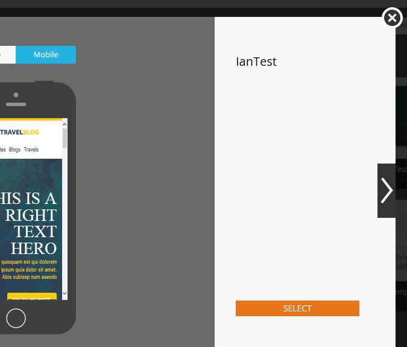

# 이메일 템플릿 선택기 개요 {#email-template-picker-overview}

[전자 메일을 만듭니다](/help/marketo/product-docs/email-marketing/general/creating-an-email/create-an-email.md). 선택할 수 있는 템플릿이 여러 개 있습니다. 나만의 템플릿을 만들어 나중에 사용할 수 있도록 저장할 수도 있습니다.

**[!UICONTROL Name]**&#x200B;은(는) 템플릿 자체가 아니라 템플릿을 기반으로 만든 전자 메일의 이름이 됩니다. **[!UICONTROL Description]**&#x200B;은(는) 전자 메일에도 적용되며 선택 사항입니다.

전자 메일이 중요한 경우 통신 제한을 피하려면 상자를 선택하여 [작동 상태로 설정](/help/marketo/product-docs/email-marketing/general/functions-in-the-editor/make-an-email-operational.md)합니다. 기본적으로 **[!UICONTROL Open in editor]**&#x200B;이(가) 선택되어 있으므로 바로 새 전자 메일 편집을 시작할 수 있습니다. **[!UICONTROL Create]**&#x200B;은(는) 만들기!

**[!UICONTROL Starter Templates]**&#x200B;에 즉시 사용 가능한 응답형 전자 메일 서식 파일 컬렉션이 포함되어 있습니다. 그대로 사용하거나 원하는 대로 사용자 지정할 수 있습니다.

**[!UICONTROL My Templates]**&#x200B;은(는) 사용자가 만든 모든 템플릿으로 구성됩니다. 폴더도 있을 수 있습니다.

**[!UICONTROL Emails]** 트리의 **[!UICONTROL Templates]** > [!UICONTROL Design Studio] 아래에 표시되는 모든 폴더는 **[!UICONTROL My Templates]**&#x200B;에서 사용할 수 있습니다.

템플릿을 미리 보려면 해당 썸네일 위로 마우스를 가져간 후 **[!UICONTROL Preview]**&#x200B;을(를) 클릭합니다. 두 번 클릭하기만 하면 됩니다.

미리 보기는 데스크톱 컴퓨터에서 템플릿이 렌더링되는 방법을 보여 줍니다.

...및 모바일 디바이스.

이 서식 파일이 마음에 들면 오른쪽 하단의 **[!UICONTROL Select]**&#x200B;을(를) 클릭하여 선택하십시오. 계속 찾아볼래요? 오른쪽 상단의 **X**&#x200B;을(를) 클릭합니다. 왼쪽 및 오른쪽 화살표를 사용하여 템플릿을 스크롤합니다.

추가 옵션을 보려면 템플릿 썸네일을 마우스 오른쪽 버튼으로 클릭할 수도 있습니다.

>[!NOTE]
>
>템플릿 썸네일의 좋은 점은 라이브 상태라는 것입니다. 따라서 템플릿을 변경하면 썸네일도 함께 변경됩니다.

꽤 깔끔해!

>[!MORELIKETHIS]
>
>* [전자 메일 템플릿 구문](/help/marketo/product-docs/email-marketing/general/email-editor-2/email-template-syntax.md)
>* [전자 메일 만들기](/help/marketo/product-docs/email-marketing/general/creating-an-email/create-an-email.md)
