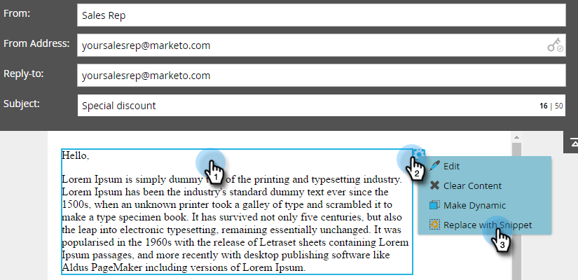

# 이메일에 코드 조각 추가 {#add-a-snippet-to-an-email}

스니펫은 이메일 및 랜딩 페이지에서 사용할 수 있는 서식 있는 텍스트 및 그래픽의 재사용 가능한 블록입니다.

>[!PREREQUISITES]
>
>[코드 조각 만들기](/help/marketo/product-docs/personalization/segmentation-and-snippets/snippets/create-a-snippet.md)

>[!NOTE]
>
>[Marketo 전자 메일 구문](/help/marketo/product-docs/email-marketing/general/email-editor-2/email-template-syntax.md)을 스니펫에 포함할 수 없습니다. 전자 메일에는 **사용할 수 없습니다**. 스니펫은 본문 콘텐츠(HTML + 텍스트)여야 합니다.

1. 전자 메일을 찾아 선택하고 **초안 편집**&#x200B;을 클릭합니다.

   

1. 코드 조각으로 변환할 편집 가능한 영역을 선택하고 톱니바퀴 아이콘을 클릭한 다음 **코드 조각으로 바꾸기**&#x200B;를 선택합니다.

   

1. 원하는 코드 조각을 선택하고 **저장**&#x200B;을 클릭합니다.

   

   >[!NOTE]
   >
   >드롭다운에는 승인된 스니펫만 표시됩니다.

   

   >[!NOTE]
   >
   >코드 조각을 업데이트하고 승인할 때마다 변경 사항이 이메일에 반영됩니다. [초안 없음](/help/marketo/product-docs/administration/users-and-roles/enable-no-draft-for-snippets.md)을 사용하여 코드 조각을 승인하지 않는 한 전자 메일이 초안 처리됩니다.

다이내믹 콘텐츠를 빠르고 간편하게 다시 사용할 수 있는 방법입니다.
