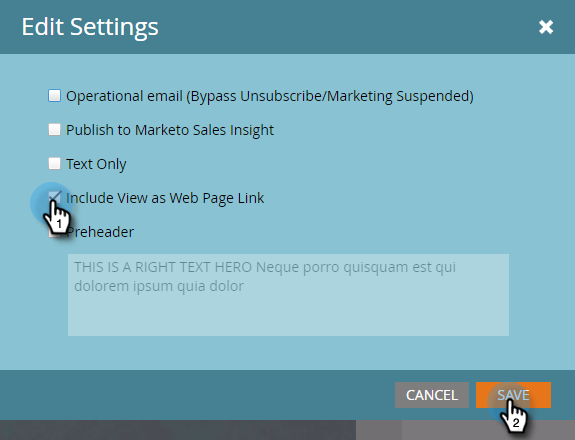

# 이메일에 웹 페이지로 보기 링크 추가 {#add-a-view-as-web-page-link-to-an-email}

이메일에는 제한된 기능(CSS 및 JavaScript 또는 양식 없음)이 있습니다. [웹 페이지로 보기]를 사용하여 브라우저에 이메일을 표시하는 링크를 제공합니다. 이렇게 하면 수신자가 Munchkin을 사용하여 쿠키를 사용할 수 있습니다.

>[!NOTE]
>
>새 이메일을 만들 때 웹 페이지로 보기가 활성화되지 않습니다. 이메일을 활성화하고 복제하면 이 설정이 복사됩니다.

1. 이메일을 선택하고 초안 **편집을 클릭합니다**.

   

1. 이메일 편집기에서 **이메일 설정을 클릭합니다**.

   

1. [ **웹 페이지로 보기 포함** ] 상자를 선택하고 **저장을 클릭합니다**.

   

다음은 이것의 예입니다.

>[!TIP]
>
>이메일을 보내기 전에는 웹 페이지로 보기 링크가 표시되지 않습니다. 볼 수 있는 테스트를 직접 전송합니다.

기본 텍스트를 변경하려면 &quot;웹 페이지로 [보기&quot; 메시지 편집을 참조하십시오](../../../../product-docs/administration/email-setup/edit-the-view-as-web-page-message.md).