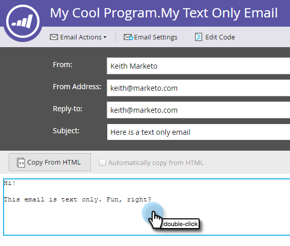

# 텍스트 이메일에 추적된 링크 추가 {#add-tracked-links-to-a-text-email}

>[!PREREQUISITES]
>
>* [텍스트 전용 전자 메일 만들기](/help/marketo/product-docs/email-marketing/general/creating-an-email/create-a-text-only-email.md)
>* [전자 메일의 요소 편집](/help/marketo/product-docs/email-marketing/general/email-editor-2/edit-elements-in-an-email.md)

텍스트 이메일 링크는 Marketo에서 추적할 수 있습니다. 어떻게 작동하는지 알아보겠습니다. 1. 이메일을 선택하고 초안 편집을 클릭합니다.

1. 링크를 추가할 편집 가능 영역을 두 번 클릭합니다.

   

1. `[[www.domain.com/path/page.html]]`과(와) 같이 이중 대괄호로 URL을 입력하십시오.

   

1. 편집기를 닫고 초안 승인 잊지 마십시오.

   

>[!NOTE]
>
>mktNoTok 클래스 기능은 텍스트 이메일의 추적 가능한 링크에서 작동하지 않습니다. HTML 이메일에만 해당됩니다.

>[!TIP]
>
>다시 한 번 확인하기 위해 테스트해 보십시오. 대괄호를 올바르게 입력했는지 확인하십시오.

잘했어요!
