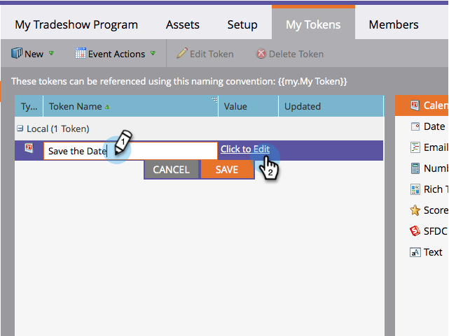

# 달력 이벤트(.ics) 파일 만들기 {#create-a-calendar-event-ics-file}

달력 파일 토큰을 사용하면 달력 이벤트(.ics) 링크를 마케팅 이메일 및 랜딩 페이지에 추가할 수 있습니다.

1. 프로그램 내에서 내 토큰 **탭으로** 이동합니다.

   

1. 달력 **파일** 토큰을 캔버스로 드래그합니다.

   

1. 토큰 **이름** 및 **편집을 입력합니다**.

   

1. 세부 사항을 입력하고 **저장을 클릭합니다**.

   

임무 완료! 반드시 테스트해 보십시오.

>[!NOTE]
>
>**관련 문서**
>
>* [이메일에 달력 이벤트(.ics) 포함](include-a-calendar-event-ics-in-an-email.md)
>* [랜딩 페이지에 달력 이벤트 ICS 파일 포함](../../../../product-docs/demand-generation/landing-pages/personalizing-landing-pages/include-a-calendar-event-ics-file-in-a-landing-page.md)

>

