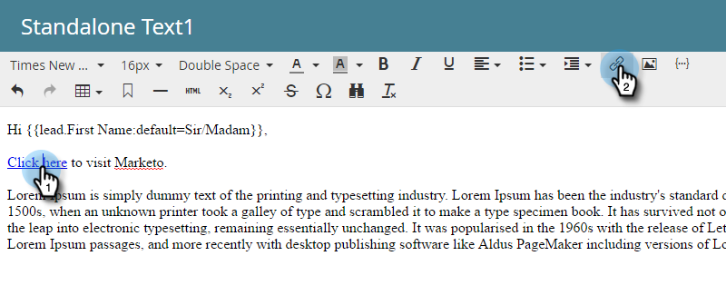
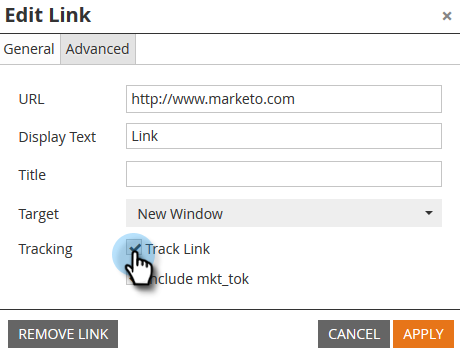
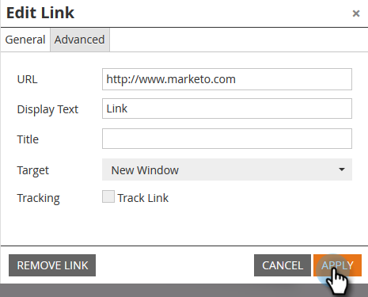

# 이메일 링크 {#disable-tracking-for-an-email-link} 추적 비활성화

이메일의 링크에서 **마케팅 추적 URL**&#x200B;을 활성화하지 않으려는 경우가 있습니다. 이 기능은 대상 페이지가 URL 매개 변수를 지원하지 않고 링크가 끊어질 수 있는 경우에 유용합니다.

1. 전자 메일을 선택하고 **초안 편집**&#x200B;을 클릭합니다.

   

1. 링크가 포함된 편집 가능 섹션을 두 번 클릭합니다.

   

1. 해당 링크를 클릭한 다음 **링크 삽입/편집** 단추를 클릭합니다.

   

1. [링크 편집] 팝업에서 **링크 추적** 확인란의 선택을 취소합니다.

   

1. **mkt_tok 포함 상자**&#x200B;이 사라집니다. **적용**&#x200B;을 클릭합니다.

   

   >[!TIP]
   >
   >**Include mkt_tok**&#x200B;만 선택 해제해도 여전히 링크를 추적할 수 있지만 리디렉션 후에도 대상 URL에 mkt_tok 쿼리 문자열 매개 변수가 포함되지 않습니다. 이 매개 변수는 Marketing To 랜딩 페이지 및 Munchkin에서 개인 활동을 적절하게 추적하는 데 사용됩니다(예를 들어, 사용자가 이메일을 구독하지 않은 경우). 매개 변수가 있기 때문에 웹 사이트에서 이상한 동작을 보지 않는 한 이 기능을 사용하지 않아야 합니다.

1. **저장**&#x200B;을 클릭합니다.

   

   >[!TIP]
   >
   >이메일 **템플릿**에서 링크에 대한 클릭 추적을 비활성화하시겠습니까? 다음 형식을 사용합니다.
   >`<a class="mktNoTrack" href="http://www.mywebsite.com">This link does not have tracking</a>`\
   >이 구현 작업에 도움이 필요한 경우 웹 개발자에게 문의하십시오.

좋아! 이제 링크에 대한 추적을 비활성화했습니다.
