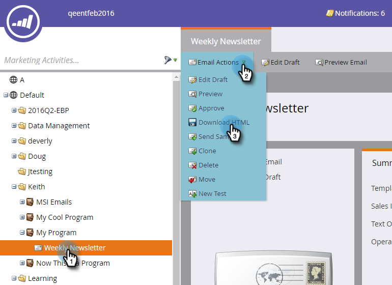

# 이메일의 HTML 다운로드 {#download-an-emails-html}

백업 및 기타 목적을 위해 Marketo에서 이메일의 HTML 콘텐츠를 다운로드할 수 있습니다.

1. 이메일을 찾아 선택합니다. **[!UICONTROL Email Actions]** 드롭다운에서 **[!UICONTROL Download HTML]**&#x200B;을(를) 클릭합니다.

   

그렇게 쉬워!
