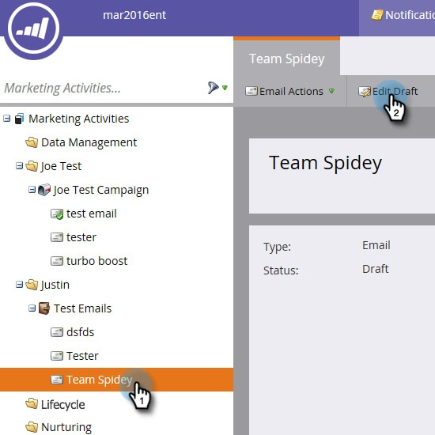

# 이메일의 HTML 편집 {#edit-an-emails-html}

이메일의 기본 HTML을 수정해야 하는 경우가 있습니다. 때때로 외부 시스템을 사용하여 이메일 코드를 디자인하고 빌드할 수 있습니다. 어느 방식이든 이메일 편집기 내에서 코드를 쉽게 가져오거나 편집할 수 있습니다.

## HTML 편집 {#edit-html}

1. 전자 메일을 선택하고 **[!UICONTROL Edit Draft]**&#x200B;을(를) 클릭합니다.

   

1. **[!UICONTROL Edit Code]**&#x200B;을(를) 클릭합니다.

   

1. 원하는 대로 변경합니다. 완료되면 **[!UICONTROL Save]**&#x200B;을(를) 클릭합니다.

   

   >[!NOTE]
   >
   >원하는 대로 변경하십시오. 전체 HTML을 바꾸거나 약간 조정할 수 있습니다.

1. **[!UICONTROL Code Actions]** 드롭다운을 클릭하여 코드를 .html 파일로 다운로드하거나 CSS를 인라인하거나 HTML의 유효성을 검사합니다.

   

   >[!NOTE]
   >
   >이메일의 가장 좋은 방법은 모든 스타일을 인라인으로 만드는 것입니다. 일부 이메일 클라이언트는 `<head>` 섹션 내에서 CSS를 지원하지 않습니다.

## 템플릿에서 이메일 깨기 {#breaking-an-email-from-its-template}

다음 코드 변경 **은(는) 해당 템플릿에서 전자 메일을 중단하지 않습니다**.

* 모듈의 내용 편집(모듈 내에 새 요소 추가 포함)
* 컨테이너에 새 모듈 추가
* 컨테이너에서 모듈 삭제

* 모듈 외부에 있는 요소의 mkto 관련 속성(예: &quot;mktoName&quot; 또는 &quot;mktoImgUrl&quot;) 변경
* 모듈 외부의 모든 요소(리치 텍스트, 이미지, 비디오 등)의 콘텐츠 편집

코드 편집기 **will**&#x200B;에서 수행할 수 있는 작업은 해당 템플릿에서 전자 메일을 중단합니다.

* 요소 또는 모듈 외부에 있는 코드의 모든 항목 변경
* 모듈 외부에 있는 요소의 mkto 속성이 아닌 특성(예: &quot;id&quot; 또는 &quot;style&quot;) 추가 또는 변경
* 모듈 외부에 있는 요소 삭제

## 코드 검색 {#search-code}

코드 검색 기능을 사용하여 이메일의 HTML 코드 내에서 콘텐츠를 효율적으로 찾고 바꿀 수 있습니다.

1. 전자 메일 코드에서 **[!UICONTROL Search Code]**&#x200B;을(를) 클릭합니다.

   

1. 찾을 내용을 입력하고 **[!UICONTROL Find Next]**&#x200B;을(를) 클릭하여 앞으로 검색하거나 **[!UICONTROL Find Previous]**&#x200B;을(를) 클릭하여 뒤로 검색하십시오. **[!UICONTROL Replace]** 및 **[!UICONTROL Replace All]**&#x200B;에 대한 옵션도 있습니다.

   

1. 완료되면 **[!UICONTROL Close]**&#x200B;을(를) 클릭합니다.

   

   >[!NOTE]
   >
   >검색 코드는 [전자 메일 템플릿 편집기](/help/marketo/product-docs/email-marketing/general/email-editor-2/create-an-email-template.md)에서도 사용할 수 있습니다.

Marketo의 기본 기능을 사용하여 이메일을 계속 편집하는 것이 좋지만 이 코드 편집기는 필요한 경우 유연성을 제공합니다.
