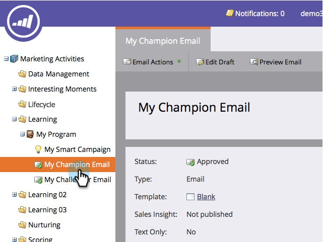

# 이메일 챔피언/도전자 추가 {#add-an-email-champion-challenger}

이메일이 제대로 작동하는지 확인하기 위해 자주 사용하는 이메일을 테스트하는 것이 좋습니다. 한 가지 방법은 이메일의 효율성을 다른 버전 또는 도전자와 비교하는 것입니다. 챔피언/도전자 테스트에서는 전체 이메일, 제목 줄 또는 보낸 사람 주소를 테스트할 수 있습니다.

테스트하는 기존 이메일은 챔피언으로 간주됩니다. 테스트 내에서 만드는 모든 변형은 도전자로 간주됩니다. 챔피언 콘텐츠 또는 도전자 콘텐츠를 받는 사용자의 비율을 결정합니다. 여러 도전자를 정의한 경우 도전자 그룹 간에 균등하게 배포됩니다.

시작하는 방법은 다음과 같습니다.

>[!PREREQUISITES]
>
>* [프로그램 만들기](/help/marketo/product-docs/core-marketo-concepts/programs/creating-programs/create-a-program.md)
>* [이메일 만들기](/help/marketo/product-docs/email-marketing/general/creating-an-email/create-an-email.md)

>[!CAUTION]
>
>Champion/Challenger 이메일은 트리거 캠페인 및 참여 프로그램 스트림에서만 작동합니다. 배치 메일링의 경우 이메일 프로그램의 [A/B 테스트 기능](/help/marketo/product-docs/email-marketing/email-programs/email-program-actions/email-test-a-b-test/add-an-a-b-test.md).

1. 이동 **마케팅 활동**.

   

1. 이메일을 찾아 선택합니다.

   

   >[!NOTE]
   >
   >일회용 메일 폭발을 보려면 [이메일 프로그램](/help/marketo/product-docs/email-marketing/email-programs/creating-an-email-program/create-an-email-program.md).

1. 아래 **이메일 작업**&#x200B;를 클릭합니다. **새 테스트**.

   

1. 다른 테스트 유형 옵션이 있는 새 창이 열립니다. 각각에 대해 알아보려면 아래 관련 문서를 참조하십시오.

   >[!MORELIKETHIS]
   >
   >* [챔피언/도전자: 전체 이메일](/help/marketo/product-docs/email-marketing/general/functions-in-the-editor/email-tests-champion-challenger/champion-challenger-whole-emails.md)
   >* [챔피언/도전자: 제목 줄](/help/marketo/product-docs/email-marketing/general/functions-in-the-editor/email-tests-champion-challenger/champion-challenger-subject-line.md)
   >* [챔피언/도전자: 보낸 사람 주소](/help/marketo/product-docs/email-marketing/general/functions-in-the-editor/email-tests-champion-challenger/champion-challenger-from-address.md)

