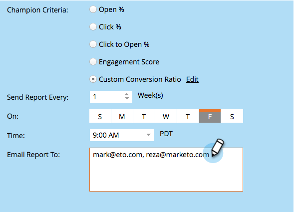

# 챔피언/챌린저: Analytics {#champion-challenger-analytics}

보고서 경고를 받거나 챔피언/챌린저 대시보드에서 유용한 분석을 검토합니다.

>[!PREREQUISITES]
>
>[챔피언/챌린저: 챔피언 기준 정의](/help/marketo/product-docs/email-marketing/general/functions-in-the-editor/email-tests-champion-challenger/champion-challenger-define-champion-criteria.md)

## 보고서 경고 구성 {#configure-report-alerts}

Marketo에서 이메일 테스트 진행 방식에 대한 보고서를 보내드립니다. 예약 방법은 다음과 같습니다.

1. 보고서를 매주 금요일 오전 9시에 보내도록 일정을 잡읍시다.

   

   >[!TIP]
   >
   >원하는 경우 여러 요일을 선택할 수 있습니다. 선택하려면 를 클릭하고, 선택 취소하려면 를 다시 클릭합니다.

1. 보고서를 보낼 이메일 주소를 입력합니다.

   

1. **다음**&#x200B;을 클릭합니다.

   

1. 모든 정보가 올바른지 확인하고 **닫기**&#x200B;를 클릭합니다.

   

   이 보고서에는 테스트 유형, 승자 기준, 이메일 열기 수 등 세부 정보가 포함됩니다. 또한 테스트 자체로 직접 연결되어 우승자를 선언할 수 있습니다. 멋지다.

## 챔피언/챌린저 대시보드 {#champion-challenger-dashboard}

챔피언/챌린저 대시보드는 챔피언/챌린저 실험(열기, 클릭 수, 구독 취소 비율 및 이메일 테스트 구성 중에 사용된 기타 변수)에서 컨트롤 및 변형의 성능에 대한 자세한 분석을 제공합니다. 또한 대시보드에는 다양한 이메일 변형에 대한 타겟팅된 대상자에 대한 배포 세부 정보와 모든 변형에 대한 열기, 클릭 수, 클릭에서 열기 비율 및 구독 취소에 대한 집계 비율이 제공됩니다.

