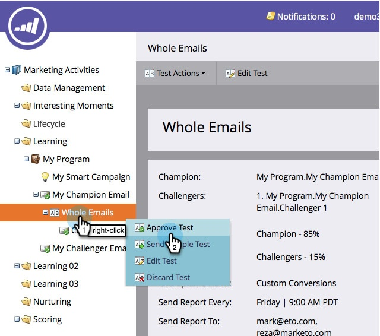

# 챔피언/도전자:이메일 테스트 승인 {#champion-challenger-approve-your-email-test}

이메일 테스트를 승인하도록 이메일 테스트를 설정하는 마지막 단계입니다. 방법

>[!PREREQUISITES]
>
>* [챔피언/도전자:보고서 경고 구성](champion-challenger-configure-report-alerts.md)

>

1. **마케팅 활동**&#x200B;으로 이동합니다.

   

1. **테스트 이메일**&#x200B;을 찾아 마우스 오른쪽 단추로 클릭한 다음 **테스트 승인**&#x200B;을 클릭합니다.

   

   >[!NOTE]
   >
   >**미리 알림**
   >
   >
   >**전체 이메일******테스트를 승인할 때 먼저 도전자 이메일을 승인하십시오.

   >[!NOTE]
   >
   >테스트를 전송하려면 트리거 캠페인의 **이메일 보내기** 흐름 단계에서 테스트를 추가한 이메일을 선택합니다. 참여 프로그램 스트림에 해당 이메일을 삽입할 수도 있습니다. 챔피언/도전자 이메일은 일괄 캠페인에서 작동하지 않습니다.

   그렇게 쉽지 않았어? 몇 개의 보고서를 받으면 챔피언을 선언합니다.

   >[!MORELIKETHIS]
   >
   >
   >    
   >    
   >    * [챔피언/도전자:챔피언 선언](champion-challenger-declare-a-champion.md)
   >    * [챔피언/도전자:이메일 테스트 취소](champion-challenger-discard-an-email-test.md)

