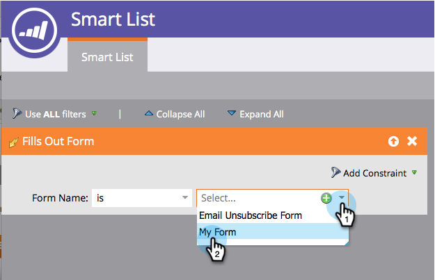

# 챔피언/도전자:챔피언 기준 정의 {#champion-challenger-define-champion-criteria}

테스트 유형을 설정했으면 챔피언 기준을 정의해야 합니다. 방법

>[!PREREQUISITES]
>
>* [이메일 챔피언/도전자 추가](add-an-email-champion-challenger.md)

>

## 표준 챔피언 기준 {#standard-champion-criteria}

1. 사용 가능한 **챔피언 기준** 중 하나를 선택합니다.

   

   >[!NOTE]
   >
   >이 지표를 추적하고 데이터를 이메일로 전송합니다.

1. 기본 **챔피언 기준** 중 하나를 선택한 경우 계속 [챔피언/챌린저:보고서 경고 구성](champion-challenger-configure-report-alerts.md)!

## 사용자 지정 챔피언 기준 {#custom-champion-criteria}

1. 마음에 드는 경우 **사용자 지정 전환**&#x200B;을 선택하고 **편집**&#x200B;을 클릭하여 사용자 지정을 진행할 수 있습니다.

   

   >[!NOTE]
   >
   >이를 통해 트리거 및 필터를 사용하여 이벤트를 전환으로 설정할 수 있습니다.

1. 창이 나타납니다. 원하는 트리거를 찾아 캔버스로 드래그합니다.

   

1. 트리거를 정의합니다.

   

   Marketing To는 이 이메일 프로그램에서 이메일을 보낸 사람의 트리거만 허용합니다. &quot;보낸 이메일&quot; 필터를 추가할 필요가 없습니다.

1. **닫기**&#x200B;를 클릭합니다.

   

   좋아요! 이제 보고서를 예약할 때입니다.

   >[!MORELIKETHIS]
   >
   >
   >    
   >    
   >    * [챔피언/도전자:보고서 경고 구성](champion-challenger-configure-report-alerts.md)

