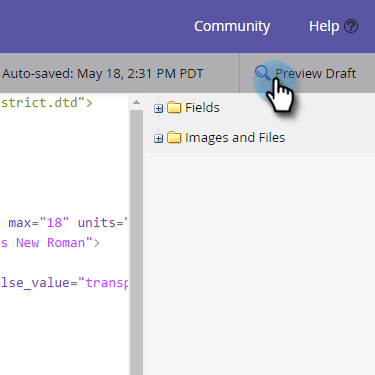
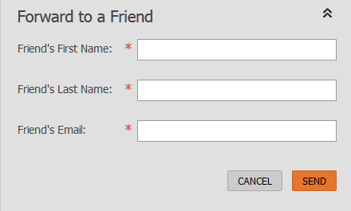
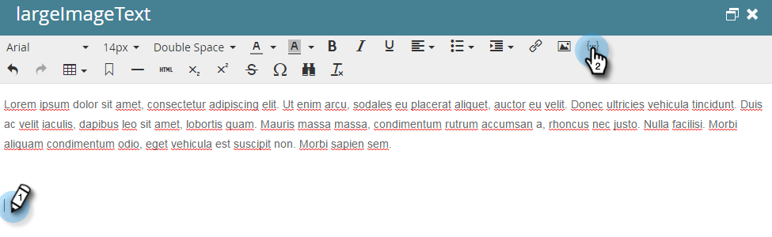
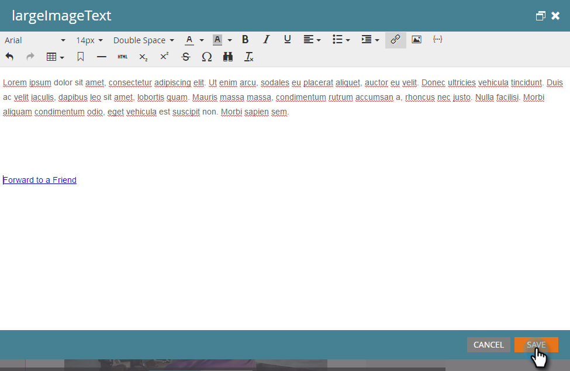

# 이메일 {#forward-to-a-friend-link-in-emails}의 친구 링크로 전달

이메일에 &#39;친구에게 보내기&#39; 링크를 추가하면 이 링크를 통해 전달된 이메일을 받은 사람을 추적할 수 있으며, 데이터베이스에 아직 없는 경우 자동으로 새 사람으로 추가할 수 있습니다.

예를 들어 Keith가 &#39;친구에게 보내기&#39; 링크를 사용하여 미지의 사람 Mark에게 이메일을 전달한다고 가정해 봅시다. 마크는 자동으로 새 사람으로 추가되고 자신만의 쿠키가 할당되며, 모든 이메일 및 웹 활동이 그와 연결됩니다. 하지만, Keith가 이메일 클라이언트에서 [앞으로] 단추를 사용하는 경우 Mark가 Keith로 잘못 쿠킹되고 해당 활동이 Keith로 기록됩니다.

## 이메일 템플릿 {#add-the-link-to-an-email-template}에 링크 추가

1. **디자인 스튜디오**&#x200B;로 이동합니다.

   

1. 링크를 추가할 이메일 템플릿을 찾아 선택합니다. **초안 편집**&#x200B;을 클릭합니다.

   

1. &#39;친구에게 전달&#39; 링크를 표시할 HTML 코드를 붙여 넣습니다(이 부분에 대한 도움이 필요한 경우 웹 개발자와 상의하십시오).

   `<pre data-theme="Confluence"><a href="{{system.forwardToFriendLink}}">Forward to Friend</a></pre>`

   

   >[!TIP]
   >
   >
   >링크에 스타일을 추가하여 더 멋지게 만들 수 있습니다. 예:
   >
   >`<a href="{{system.forwardToFriendLink}}" style="font-family:arial, sans-serif; padding:10px; position:absolute; right:0px;">Forward to Friend</a>`

   >[!CAUTION]
   >
   >이메일 템플릿에서 스타일 **position:relative**&#x200B;을 사용하지 않는 것이 좋습니다. &#39;친구에게 전달&#39; 상자의 위치 및 표시 관련 문제가 발생할 수 있습니다.

1. **초안 미리 보기**&#x200B;를 클릭하여 템플릿이 원하는 대로 표시되는지 확인합니다.

   

   >[!NOTE]
   >
   >변경 사항을 적용하려면 템플릿 초안을 승인해야 합니다.

   이제 해당 템플릿을 사용하는 모든 이메일에는 &#39;친구에게 전달&#39; 링크가 포함됩니다. 이메일 수신자가 이메일 링크를 클릭하면 &#39;친구에게 전달&#39; 상자가 있는 이메일의 웹 버전으로 이동합니다.

   

## 개별 이메일 {#add-the-link-to-an-individual-email}에 링크 추가

&#39;친구에게 전달&#39; 링크를 이메일에 직접 추가할 수도 있습니다.

1. 링크를 포함할 이메일을 열고 편집 가능 영역을 두 번 클릭합니다.

   

1. 링크를 표시할 위치에 커서를 놓고 **토큰 삽입** 단추를 클릭합니다.

   

1. **`{{system.forwardToFriendLink}}`** 토큰을 선택합니다.

   

   >[!NOTE]
   >
   >이 토큰은 &#39;친구에게 전달&#39; 상자가 있는 이메일의 웹 버전의 URL입니다.

1. 링크의 표시 텍스트를 원하는 대로 작성합니다(예: &quot;친구에게 보내기&quot;).

   

1. Ctrl+X(Windows) 또는 Cmd+X(Mac)를 사용하여 **`{{system.forwardToFriendLink}}`** 토큰을 잘라냅니다. &quot;친구에게 전달&quot;을 선택하고 **링크 삽입/편집** 단추를 클릭합니다.

   

1. **`{{system.forwardToFriendLink}}`** 토큰을 Ctrl/Cmd+V를 사용하여 **URL** 상자에 붙여 넣은 다음 **삽입**&#x200B;을 클릭합니다.

   

1. 편집을 저장하고 새 링크를 미리 봅니다!

   

   >[!NOTE]
   >
   >&#39;친구에게 전달&#39; 이메일을 수신하여 추가된 새 사람은 기본적으로 마케팅 이메일에 가입되어 있지 않습니다.

## 전달 활동 보기 {#view-forwarding-activity}

개인의 활동 로그에서 이메일을 전달 및 받은 사람을 확인할 수 있습니다.

1. **`Database`**&#x200B;으로 이동합니다.

   

1. 활동을 볼 사람을 두 번 클릭합니다.

   

1. **활동 로그** 탭으로 이동합니다. 자세한 내용을 보려면 **친구에게 보낸 이메일** 또는 **친구에게 보낸 이메일**&#x200B;을 두 번 클릭합니다.

   

   >[!NOTE]
   >
   >**정의**
   >
   >친구에게 보낸 이메일의 경우 사람 ID는 이메일을 전달한 사람입니다.
   >
   >[친구에게 보낸 이메일]에서 사람 ID는 이메일을 받은 사람입니다.

   

1. ID로 사람을 보려면 **개인 ID**&#x200B;를 복사하여 URL의 끝에 붙여 넣습니다(해당 URL의 시작은 마케팅 인스턴스에 따라 달라짐).

   `<pre data-theme="Confluence">...marketo.com/Database/loadPersonDetail?personId=</pre>`

   >[!NOTE]
   >
   >**사람 ID**&#x200B;를 클릭하고 예정된 패치의 사람에게 직접 연결합니다.

   

   >[!NOTE]
   >
   >앞으로 받는 친구가 알 수 없는 사람인 경우, &#39;친구에게 전달&#39;을 &#39;사람의 **소스**로 표시한 새로운 사람이 만들어집니다.
   >이메일이 프로그램의 로컬 자산인 경우 프로그램은 사용자의 **획득 프로그램**&#x200B;으로 표시됩니다.

## 전달 활동 {#trigger-or-filter-using-forwarding-activity}을(를) 사용하여 트리거 또는 필터

흐름 작업을 트리거하거나 &#39;친구에게 전달&#39; 활동을 수신하여 사람을 필터링하는 데 사용할 수 있는 6개의 트리거/필터가 있습니다.

스마트 캠페인의 스마트 목록에서 &quot;앞으로&quot;를 검색하면 사용 가능한 트리거와 필터를 찾을 수 있습니다.

## 친구에게 테스트 전달 {#test-forward-to-friend}

&#39;친구에게 전달&#39;을 테스트하려면 앞으로 링크가 포함된 이메일을 자신에게 전송합니다. **전자 메일 보내기** 흐름 단계를 통해 보내십시오. *이 아닌*&#x200B;테스트 전자 메일 보내기&#x200B;**를 통해 보내십시오.**
