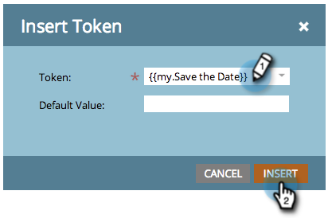

# 이메일 {#include-a-calendar-event-ics-in-an-email}에 달력 이벤트(.ics) 포함

달력 파일 토큰을 사용하면 마케팅 이메일에 달력 이벤트(.ics) 링크를 추가할 수 있습니다.

>[!PREREQUISITES]
>
>* [달력 이벤트(.ics) 파일 만들기](create-a-calendar-event-ics-file.md)

>

1. 프로그램의 이메일을 편집하는 동안 토큰을 이동할 위치를 클릭한 다음 토큰 삽입 버튼을 클릭합니다.

1. 달력 파일 토큰을 선택하고 **삽입**&#x200B;을 클릭합니다.

   

   저장을 클릭합니다.

   

   수신자는 이와 같은 이메일을 수신하게 됩니다.

   

임무 완수!
