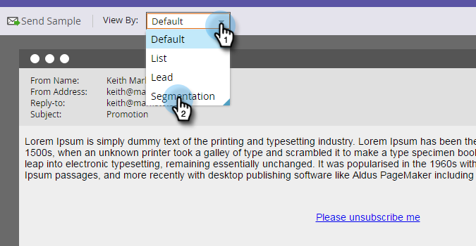

# 다이내믹 콘텐츠를 사용한 이메일 미리 보기 {#preview-an-email-with-dynamic-content}

다이내믹 컨텐츠를 추가한 후 이메일을 미리 보고 확인합니다.

1. 이메일을 선택하고 을(를) 클릭합니다 **이메일 미리 보기**.

   

1. 보기 기준 드롭다운을 클릭하고 미리 보려는 동적 컨텐츠 유형을 선택합니다.

   

1. 새 드롭다운이 나타납니다. 클릭하여 특정 콘텐츠를 선택합니다.

   

1. 화살표를 사용하여 옵션을 스크롤합니다.

   

이메일 편집기에서 직접 다이내믹 컨텐츠를 미리 볼 수도 있습니다.

1. 아래 **컨텐츠**&#x200B;를 클릭하고 **동적** 탭.

   

1. 미리 보려는 컨텐츠를 클릭합니다.

   

좋아요! 전자 메일을 미리 보고 콘텐츠가 원하는 대로 작동하는지 확인하십시오.
