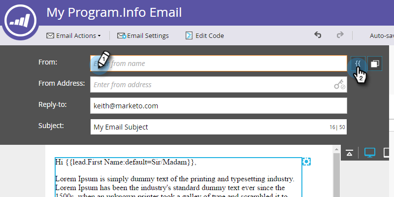

# 리드 소유자로부터 이메일 보내기 {#send-emails-from-the-lead-owner}

리드 소유자를 대신하여 리드에 이메일을 보내려면 어떻게 해야 합니까?  방법

1. 이메일을 찾아 선택한 다음 초안 **편집을 클릭합니다**.

   

1. 시작 **필드(기존 이름 삭제)를** 클릭하고 토큰 **삽입** 단추를 클릭합니다.

   

1. &quot;`{{lead.Lead Owner`&quot;을 입력하고 **`{{lead.Lead Owner First Name}}`** 토큰을 선택합니다.

   

1. 리드에 아직 리드 소유자가 없을 경우 기본값을 입력하고 **삽입을 클릭합니다**.

   

1. 첫 번째 토큰 뒤 을 클릭하고 공간을 추가한 다음 토큰 **삽입** 단추를 클릭합니다.

   

1. &quot;`{{lead.Lead Owner`&quot;을 입력하고 **`{{lead.Lead Owner Last Name}}`** 토큰을 선택합니다.

   

1. 리드에 아직 리드 소유자가 없을 경우 기본값을 입력하고 **삽입을 클릭합니다**.

   

   >[!TIP]
   >
   >이름과 성 토큰 사이에 공백이 추가되어 있는지 확인하십시오.

   이메일에서 필드(기존 이메일 주소 삭제)를 클릭하고 토큰 삽입 단추를 클릭합니다.
   

1. &quot;`{{lead.Lead Owner`&quot;을 입력하고 **`{{lead.Lead Owner Email Address}}`** 토큰을 선택합니다.

   

1. 리드에 아직 리드 소유자가 없을 경우 기본값을 입력하고 **삽입을 클릭합니다**.

   

1. 회신 **및 제목** 필드가 **채워져** 완료되었는지 확인합니다.

   

