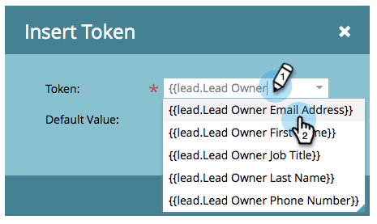

# 잠재 고객 소유자로부터 이메일 보내기 {#send-emails-from-the-lead-owner}

잠재 고객 소유자를 대신하여 잠재 고객에게 이메일을 보내려면 어떻게 해야 합니까?  방법은 다음과 같습니다.

1. 전자 메일을 찾아 선택하고 **[!UICONTROL Edit Draft]**&#x200B;을(를) 클릭합니다.

   

1. **[!UICONTROL From]** 필드(기존 이름 삭제)를 클릭하고 **토큰 삽입** 단추를 클릭합니다.

   

1. &quot;`{{lead.Lead Owner`&quot;을(를) 입력하고 **`{{lead.Lead Owner First Name}}`** 토큰을 선택하십시오.

   

1. 잠재 고객에 아직 잠재 고객 소유자가 없는 경우 기본값을 입력하고 **[!UICONTROL Insert]**&#x200B;을(를) 클릭합니다.

   

1. 첫 번째 토큰 뒤에 클릭하여 공백을 추가한 다음 **토큰 삽입** 단추를 클릭합니다.

   

1. &quot;`{{lead.Lead Owner`&quot;을(를) 입력하고 **`{{lead.Lead Owner Last Name}}`** 토큰을 선택하십시오.

   

1. 잠재 고객에 아직 잠재 고객 소유자가 없는 경우 기본값을 입력하고 **[!UICONTROL Insert]**&#x200B;을(를) 클릭합니다.

   

   >[!TIP]
   >
   >이름과 성 토큰 사이에 공백을 추가해야 합니다.

1. **[!UICONTROL From Address]** 필드(기존 전자 메일 주소 삭제)를 클릭하고 **토큰 삽입** 단추를 클릭합니다.

   

1. &quot;`{{lead.Lead Owner`&quot;을(를) 입력하고 **`{{lead.Lead Owner Email Address}}`** 토큰을 선택하십시오.

   

1. 잠재 고객에 아직 잠재 고객 소유자가 없는 경우 기본값을 입력하고 **[!UICONTROL Insert]**&#x200B;을(를) 클릭합니다.

   

1. **[!UICONTROL Reply-to]** 및 **[!UICONTROL Subject]** 필드가 채워져 있는지 확인하세요!

   
