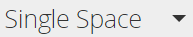

# 리치 텍스트 편집기 사용 {#using-the-rich-text-editor}

Marketo 전체에 리치 텍스트 편집기(RTE)가 나타나고 컨텐츠를 추가하거나 편집할 때마다 사용할 수 있습니다. 랜딩 페이지, 프로그램, 이메일, 양식 및 조각에 대한 버전을 볼 수 있습니다. 클릭 **초안 편집**&#x200B;그리고 당신을 위해 나타날 거야

## 편집기 설정 {#editor-settings}

루트 블록 요소 설정은 컨텐츠를 둘러싸는 태그를 정의합니다. 기본적으로 이메일 루트 블록 요소는 을 사용합니다 `
` 태그 사이에 Analytics JavaScript 코드를 배치했습니다. 아래 절차에 따라 변경할 수 있습니다.

>[!TIP]
>
>루트 블록 요소를 선택할 수 있는 옵션이 있지만 최상의 사용자 경험을 위해 항상 기본 설정을 사용하는 것이 좋습니다.

1. 클릭 **관리**.

   

1. 클릭 **이메일**.

   

1. 클릭 **텍스트 편집기 설정 편집**.

   

1. 에서 **이메일/코드 조각 편집기** 드롭다운에서 을 선택합니다. `
` 또는 없음 을 클릭하고 **저장**. `
` 이 예제에서는 가 사용됩니다.

   

   만약 `

` 이메일 템플릿에 섹션을 열고 편집기에 &quot;Text Goes Here&quot;를 입력하면 다음 HTML 소스 동작이 표시됩니다.

<table> 
 <tbody> 
  <tr> 
   <th>&lt;p&gt;</th> 
   <th>&lt;div&gt;</th> 
   <th>없음</th> 
  </tr> 
  <tr> 
   <td>
&lt;div class="“mktEditable”"&gt; &lt;p&gt;여기에 텍스트 이동&lt;/p&gt; &lt;/div&gt;
</td> 
   <td>
&lt;div class="“mktEditable”"&gt; &lt;div&gt;여기에 텍스트 이동&lt;/div&gt; &lt;/div&gt;
</td> 
   <td>
&lt;div class="“mktEditable”"&gt; 여기에 텍스트 이동 &lt;/div&gt;
</td> 
  </tr> 
 </tbody> 
</table>

>[!TIP]
>
>동일한 절차에 따라 랜딩 페이지 편집기의 루트 블록 요소를 변경할 수도 있지만 **랜딩 페이지 편집기** 이메일/코드 조각 편집기 대신 4단계에서 드롭다운을 합니다.

>[!NOTE]
>
>루트 블록 요소는 항상 `
` 리치 텍스트 프로그램 토큰용.

## 기능 {#features}

다음은 RTE에서 찾을 수 있는 기능입니다.

| 아이콘 | 이름 | 기능 |
|---|---|---|
|  | 글꼴 패밀리 | 너의 스타일을 선택해라. 우리는 충분히 있다. |
|  | 글꼴 크기 | 얼마나 큰 것으로 드릴까요? 8px에서 90px까지 25개의 선택 사항입니다. |
|  | 스타일 | [단락] 또는 6개의 제목 스타일(랜딩 페이지의 경우)을 선택합니다. |
|  | 줄 간격 | 줄 사이의 거리를 선택하세요. |
|  | 텍스트 색상 | 블랙, 레드, 네가 원하는 건 뭐든 |
|  | 배경색 | 강조를 위해 강조 표시합니다. |
|  | 굵게 | **어둡고 두꺼운**. |
|  | 기울임체 | *기울기, 강조 또는 인용* s. |
|  | 밑줄 | 텍스트 아래에 줄을 추가합니다. |
|  | 정렬 | 이 드롭다운을 사용하여 텍스트 및 이미지를 레이아웃합니다. 가운데 맞춤을 선택하거나 왼쪽 또는 오른쪽 정렬을 선택하거나 전체 정렬을 사용하여 가장자리를 가장자리로 펼칩니다. |  |  | 목록 | 드롭다운에서 글머리 기호 또는 숫자를 선택합니다. 탄환은 단계와 숫자가 있는 리스트와 숫자를 잘 쓴다. |
|  | 들여쓰기 | 들여쓰기를 하나 이상 선택합니다. 강조할 단락 또는 텍스트에 사용합니다. |
|  | 링크 삽입/편집 | 웹 사이트나 기타 컨텐츠에 대한 링크를 입력합니다. 쉽게 변경할 수 있습니다. |
|  | 이미지 삽입/편집 | 천 마디 말보다 한 장의 사진이 낫다. 한 개 넣으세요. 카메라 아이콘을 클릭하여 Design Studio를 찾습니다. 이미지를 나란히 놓을 수 있습니다. |
|  | 토큰 삽입 | 이메일 개인화 및 데이터 추적에 유용한 강력한 도구입니다. 기본값을 입력해야 합니다. |
|  | 실행 취소 | 이런! 한 걸음 뒤로 돌아가서 다시 해 봅시다. |
|  | 다시 실행 | 만약 그것이 정말로 괜찮다면, 원본으로 돌아가라. |
|  | 테이블 | 이렇게 직접 만들어보세요 드롭다운 메뉴를 사용하여 구성할 수 있습니다. |
|  | 앵커 삽입 | 앵커 내려! |
|  | 가로줄 | 많은 사용 - 섹션 분할에 적합합니다. |
|  | HTML 편집 | 코드를 수정할 수 있도록 HTML 소스 편집기를 표시합니다. |
|  | 하위 스크립트 | 줄 바꿈 문자(O와 같이)`2`). |
|  | 위 첨자 | 넌 힘이 있어! (2`6`). |
|  | 취소선 | `<s>Put a line through text, like this</s>`. |
|  | 특수 문자 | 유로에 대해 얘기할래? 수학? 243개 선택 사항이 있습니다 |
|  | 찾기 및 바꾸기 | 각 인스턴스를 직접 찾는 것보다 훨씬 빠르게 검색하고 변경합니다. |
|  | 서식 지우기 | 표준으로 돌아갑니다. |
|  | 취소 | 버튼을 눌러 &quot;신경 쓰지 마&quot; 라고 말하세요. |
|  | 저장 | 버튼을 눌러 &quot;좋아, 좋아&quot;라고 말하세요. |

>[!TIP]
>
>별도의 화면에서 HTML 및 텍스트를 편집합니다. 을(를) 클릭합니다. **HTML에서 복사** on **텍스트** 탭한 다음 **저장** 따라서 텍스트가 HTML과 일치합니다.

>[!NOTE]
>
>드롭다운에서 글꼴에만 국한되지 않습니다. 나열되지 않은 HTML 코드에 액세스하여 사용할 수 있습니다. 모든 웹 글꼴은 Marketo에서 지원되지만 웹 글꼴은 모든 이메일 클라이언트에서 일반적으로 작동하지 않습니다.

## 랜딩 페이지 {#landing-pages}

루트 블록 요소 설정은 컨텐츠를 둘러싸는 태그를 정의합니다. 기본적으로 랜딩 페이지 루트 블록 요소는 을 사용합니다 `
` 태그 사이에 Analytics JavaScript 코드를 배치했습니다. 아래 절차에 따라 변경할 수 있습니다.

>[!TIP]
>
>루트 블록 요소를 선택할 수 있는 옵션이 있지만 최상의 사용자 경험을 위해 항상 기본 설정을 사용하는 것이 좋습니다.

1. 클릭 **관리**.

   

1. 클릭 **이메일**.

   

1. 클릭 **텍스트 편집기 설정 편집**.

   

1. 에서 **랜딩 페이지 편집기** 드롭다운에서 을 선택합니다. `
` 또는 없음 을 클릭하고 **저장**. `
` 이 예제에서는 가 사용됩니다.

   

   그게 다야!
