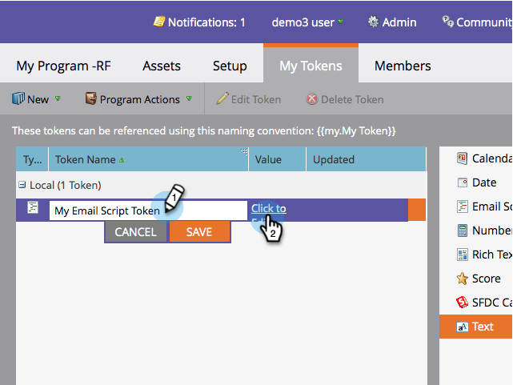

# 이메일 스크립트 토큰 만들기 {#create-an-email-script-token}

고급 개발자는 이메일에 [Velocity 스크립트를](http://velocity.apache.org/engine/1.7/user-guide.html) 사용할 수 있습니다. 방법

1. 마케팅 활동 **으로 이동합니다**.

   

1. 모든 프로그램(이벤트, 기본 또는 참여 등)을 찾아 선택합니다.

   

1. 내 **토큰** 탭 아래에서 **이메일 스크립트** 토큰을 드래그합니다.

   

1. 이메일 스크립트 토큰의 이름을 지정하고 **클릭하여 해당 컨텐츠를 편집합니다** .

   

1. 오른쪽의 트리를 사용하여 **사람, 기회**&#x200B;또는 **사용자 지정 개체** 토큰을드래그합니다.

   

   >[!NOTE]
   >
   >스토리지 시스템(기회 또는 사용자 지정 객체)에 액세스할 때 사람과 연관된 최근 10개 항목으로 제한됩니다.

1. 토큰을 스크립트 편집기로 드래그하면 토큰이 선택/활성화됩니다.

   

   >[!NOTE]
   >
   >**미리 알림**
   >
   >
   >토큰을 자유 형식으로 입력하는 경우 트리의 해당 토큰을 모두 확인/활성화하거나 일반 텍스트로 취급되므로 작동하지 않습니다.

1. Velocity로 스크립트 작성 다음은 유용한 리소스입니다.

   * [Marketing To 개발자 이메일 스크립팅 설명서](http://developers.marketo.com/email-scripting/)
   * [Velocity 사용 안내서](http://velocity.apache.org/engine/devel/user-guide.html)
   * [속도 참조 안내서](http://velocity.apache.org/engine/devel/vtl-reference-guide.html)
   * [Velocity Tools Javadoc](http://velocity.apache.org/tools/releases/2.0/javadoc/index.html)

1. 스크립트가 완료되면 **저장을 클릭합니다**.

   

1. [ **저장** ]을 한 번 더 클릭합니다.

   

이제 이메일에 이 토큰을 사용할 수 있습니다. 이메일이 전송될 때마다 스크립트가 실행됩니다.

>[!NOTE]
>
>**관련 문서**
>
>* [이메일에 이메일 스크립트 토큰 추가](add-an-email-script-token-to-your-email.md)

>

