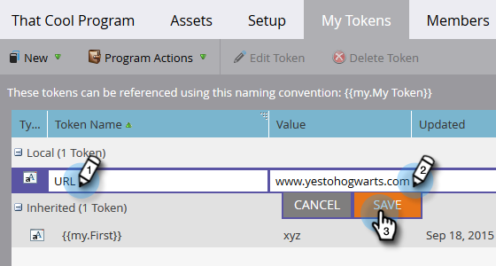
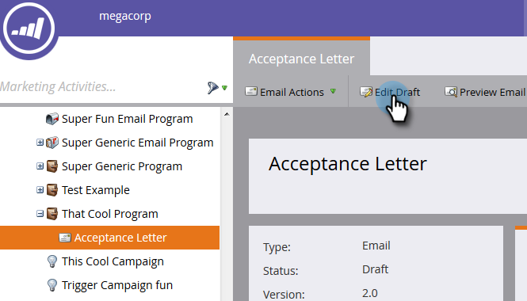
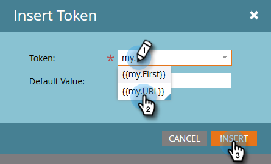

# 내 토큰 {#using-urls-in-my-tokens}에 URL 사용

내 토큰을 사용하여 이메일에 URL을 삽입하려면 아래 절차를 따르십시오.

1. 프로그램을 선택하고 **내 토큰**&#x200B;을 클릭합니다.

   

1. **텍스트** 내 토큰을 선택하고 캔버스로 드래그하여 놓습니다.

   

1. 토큰에 고유한 이름을 지정하고 URL(http:// 없이)을 입력한 다음 **저장**&#x200B;을 클릭합니다.

   

   >[!CAUTION]
   >
   >클릭이 이메일에서 추적되도록 하려면 토큰의 값 내에 http://을 입력하지 말고 **not**&#x200B;하십시오.

1. 프로그램에서 이메일을 선택합니다.

   

1. **초안 편집**&#x200B;을 클릭합니다.

   

1. 편집할 텍스트 영역을 두 번 클릭합니다.

   

1. 이메일의 아무 곳이나 &quot;http://&quot;을 입력하고(뒤에 공백이 없으면) 토큰 삽입 아이콘을 클릭합니다.

   

   >[!NOTE]
   >
   >사이트에서 사용하는 경우 &quot;https&quot;를 입력하는 옵션도 있습니다.

1. 내 토큰을 찾아 선택한 다음 **삽입**&#x200B;을 클릭합니다.

   

1. http:// 및 토큰을 강조 표시한 다음 Ctrl/Cmd+X(Ctrl = Windows/Cmd = Mac)를 눌러 텍스트를 자릅니다.

   

1. 링크를 표시할 텍스트를 강조 표시하고 링크 삽입/편집 아이콘을 클릭합니다.

   

1. Ctrl/Cmd+V를 눌러 **URL** 상자에 내용을 붙여 넣고 **삽입**&#x200B;을 클릭합니다.

   

1. **저장**&#x200B;을 클릭합니다.

   

   이제 모든 작업이 끝났습니다. URL은 전송 후 채워지며, 토큰 앞에 http://을 넣으면 추적 가능한 링크가 생성됩니다.
