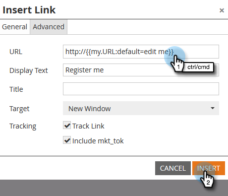

# 내 토큰에 URL 사용 {#using-urls-in-my-tokens}

[!UICONTROL My Tokens]을(를) 사용하여 전자 메일에 URL을 삽입하려면 아래 단계를 따르세요.

1. 프로그램을 선택하고 **[!UICONTROL My Tokens]**&#x200B;을(를) 클릭합니다.

   

1. **[!UICONTROL Text]** 내 토큰을 선택하고 캔버스로 끌어서 놓습니다.

   

1. 토큰에 고유한 이름을 지정하고 URL(https:// 제외)을 입력한 다음 **[!UICONTROL Save]**&#x200B;을(를) 클릭합니다.

   

   >[!CAUTION]
   >
   >**http/https 사용 중...**
   >
   >* 전자 메일에서 클릭이 추적되는지 확인하려면 토큰 값을 **입력하지 말고** https:// _inside_&#x200B;를 입력하십시오. 7단계에 표시된 대로 토큰 외부에서 사용합니다.
   >
   >* http/https를 종료하지 않는 것이 좋습니다. 이렇게 하면 전자 메일의 [웹 버전](/help/marketo/product-docs/email-marketing/general/functions-in-the-editor/add-a-view-as-web-page-link-to-an-email.md){target="_blank"}이(가) 잘못 렌더링될 수 있습니다.

1. 프로그램에서 이메일을 선택합니다.

   

1. **[!UICONTROL Edit Draft]**&#x200B;을(를) 클릭합니다.

   

1. 편집할 텍스트 영역을 두 번 클릭합니다.

   

1. 전자 메일의 어디에나 `https://`을(를) 입력하고(뒤에 공백을 남기지 않음) [토큰 삽입] 아이콘을 클릭합니다.

   

   >[!NOTE]
   >
   >사이트에서 https를 사용하지 않는 경우 `http://`을(를) 입력할 수도 있습니다.

1. 내 토큰을 찾아 선택한 다음 **[!UICONTROL Insert]**&#x200B;을(를) 클릭합니다.

   

1. https:// 및 토큰을 강조 표시한 다음 Ctrl/Cmd+X(Ctrl = Windows/Cmd = Mac)를 눌러 텍스트를 잘라냅니다.

   

1. 링크를 표시할 텍스트를 강조 표시하고 [!UICONTROL Insert/Edit Link] 아이콘을 클릭합니다.

   

1. Ctrl/Cmd+V를 눌러 콘텐츠를 **[!UICONTROL URL]** 상자에 붙여 넣고 **[!UICONTROL Insert]**&#x200B;을(를) 클릭합니다.

   

1. **[!UICONTROL Save]**&#x200B;을(를) 클릭합니다.

   

   넌 끝났어! 전송 후 URL이 채워지고 토큰 앞에 https:// 을 넣으면 추적 가능한 링크가 생성됩니다.
