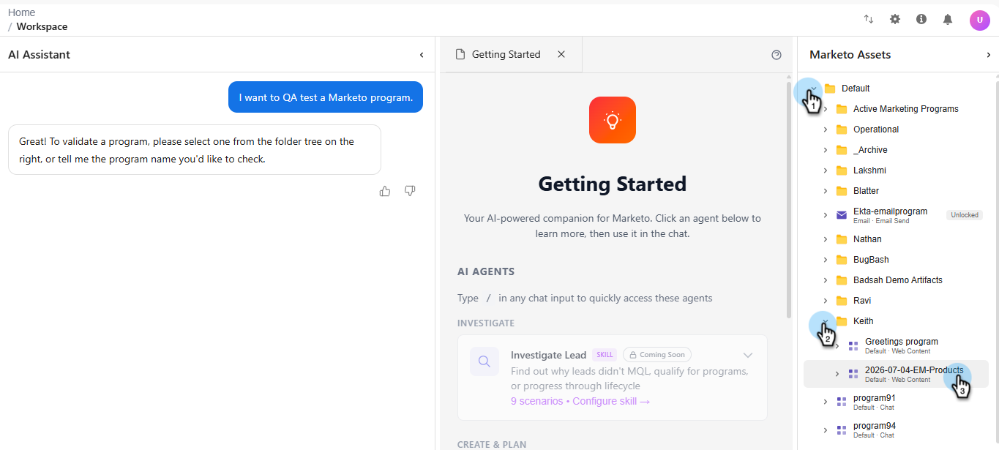
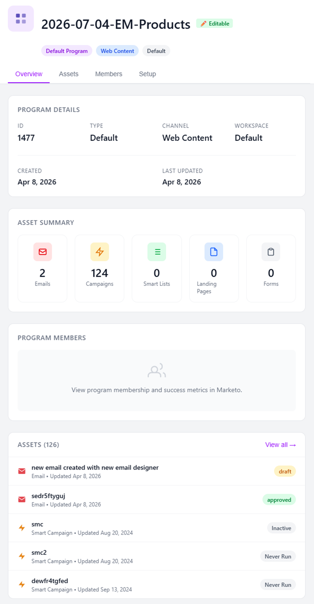

# 프로그램 QA {#program-qa}

이메일, 랜딩 페이지, 캠페인 등 모든 구성 요소에 대한 모범 사례를 살펴보려면 프로그램을 감사하십시오.

>[!NOTE]
>
>이 기능은 Open Beta이며 현재 향후 몇 달에 걸쳐 단계적으로 롤아웃될 예정입니다. 내 Marketo 화면에서 _AI로 빌드_ 타일이 표시되면 구독이 활성화될 때를 알 수 있습니다.

## 사용 방법 {#how-to-use}

1. 내 Marketo에서 **AI로 빌드** 타일을 클릭합니다.

   

1. **프로그램 QA** 에이전트를 선택하십시오.

   

   대화형 AI 화면으로 이동합니다.

1. 오른쪽 창에서 QA할 프로그램을 선택합니다.

   {width="800" zoomable="yes"}

   프로그램 요약이 중앙 창에 표시되어 프로그램에 대한 개요를 제공합니다.

   {width="450" zoomable="yes"}

1. 프롬프트 창에서 &quot;QA 프로그램&quot;을 입력하고 **보내기**&#x200B;를 클릭합니다.

   

   AI 어시스턴트는 통과한 내용과 실패한 내용을 보여주는 선택된 프로그램의 QA를 제공합니다.

   

<!--
   You have three validation paths to choose from:

   | Path | What You Provide | Verification Type | Best For |
   | --- | --- | --- | --- |
   | Rules Only | Nothing | Compliance checks | Org compliance & audits |
   | + Test Plan | Your team's test document | Rules + Custom checks | Team or channel-specific checks |
   | + Campaign Brief | Campaign brief document | Exact field matching | Pre-launch readiness |

1. To Upload a Test Plan, a Campaign Brief, or both, click the upload icon, add your files and click **Send**. To proceed with rules only, enter "Proceed with Rules Only" in the prompt window and click **Send**. In this example, we are proceeding with rules only.

PICC

1. To start validation, click **Run QA Validation**.

PICC

1. The report generates. To see the full report, click View Full Report.

PICC

1. The report appears in the center console. Scroll down to view. You can also download the report via .docx file.

PICC
-->
