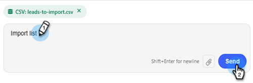

# 리드 가져오기 {#import-leads}

필드 매핑 지원을 통해 리드 목록을 Marketo Engage 데이터베이스로 가져오고 중복 제거합니다.

>[!AVAILABILITY]
>
>이 기능은 현재 오픈 베타에 있습니다. 액세스 권한을 요청하려면 계정 관리자에게 문의하십시오. [핵심 Gen-AI 약관 및 추가 약관](https://www.adobe.com/legal/terms/enterprise-licensing/genai-ww.html){target="_blank"}에도 동의해야 합니다.

## 사용 방법 {#how-to-use}

1. 내 Marketo에서 **Marketo AI** 타일을 클릭합니다.

   

1. **리드 가져오기** 에이전트를 클릭합니다.

   

   대화형 AI 화면으로 이동합니다. 왼쪽 창에는 지침, 응답 및 사용 가능한 데이터 표준화 옵션이 표시됩니다.

   

1. 리드 가져오기를 시작하려면 첨부 파일 아이콘을 클릭하고 .CSV 파일을 통해 업로드하십시오.

   

1. &quot;가져오기 목록&quot;을 입력하고 **보내기**&#x200B;를 클릭합니다.

   

   목록이 중앙 콘솔에서 미리 보입니다.

   

1. 원하는 비즈니스 규칙을 입력하고 **보내기**&#x200B;를 클릭합니다.

   

   결과가 중앙 콘솔에 표시됩니다.

   

   원하는 경우 추가 비즈니스 규칙을 입력합니다.

1. 매핑된 필드를 보려면 **매핑** 탭을 클릭하십시오.

1. 필드가 잘못 매핑된 경우 여기에서 수정하십시오.

   

1. 목록을 가져올 준비가 되면 **Marketo으로 가져오기** 탭을 클릭합니다.

1. 대상 폴더를 선택하고 이름을 입력합니다. 각 동의 상자를 선택하고 **Marketo에 승인 및 가져오기**&#x200B;를 클릭합니다.

   

가져오기가 완료되면 처리된 리드, 실패한 행 및 경고를 보여주는 확인 요약이 표시됩니다.
