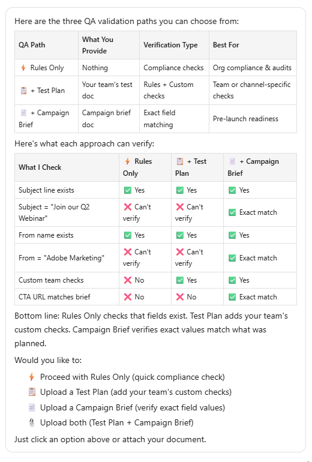

# 프로그램 유효성 검사 {#validate-programs}

이메일, 랜딩 페이지, 캠페인 등 모든 구성 요소에 대한 모범 사례를 살펴보려면 프로그램을 감사하십시오.

## 사용 방법 {#how-to-use}

1. 내 Marketo에서 **Marketo AI** 타일을 클릭합니다.

   

1. **프로그램 유효성 검사** 스킬을 선택하십시오.

1. 오른쪽 창에서 검증할 프로그램을 선택합니다.

   {width="800" zoomable="yes"}

   선택한 프로그램의 요약이 중앙 창에 나타납니다.

1. 프롬프트 창에서 &quot;프로그램 유효성 검사&quot;를 입력하고 **보내기**&#x200B;를 클릭합니다.

   AI 도우미는 선택한 프로그램의 QA를 제공하며, 무엇이 통과했고 무엇이 실패했는지 보여 줍니다.

   
