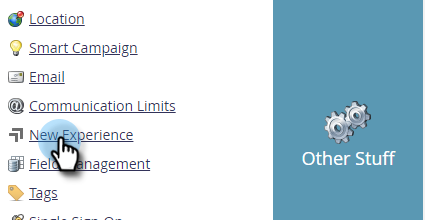

# 스위치 전환 {#toggle-switch}

전환 스위치를 사용하면 Marketo의 클래식 인터페이스와 차세대 Marketo Engage 경험 간에 전환할 수 있습니다. 이 기능은 아래에 강조 표시된 모든 영역에서 사용할 수 있습니다.

>[!NOTE]
>
>전환 스위치를 선택하면 UI 변경 사항이 발생하기 전에 기존의 모든 워크플로우가 자동으로 저장됩니다. 작업이 이미 진행 중인 경우(예: 자산이 승인되는 중), 이와 같이 표시되는 오류 메시지가 표시되며 작업이 완료된 후 다시 시도하십시오.

## 개별 역할에 대해 전환 스위치 활성화 {#enable-the-toggle-switch-for-individual-roles}

개별 역할 또는 모든 역할에 대해 전환 스위치를 활성화합니다. 방법은 다음과 같습니다.

1. Marketo Engage에서 **관리**.

   

1. 클릭 **새 경험**.

   

1. 전환 스위치에 액세스할 역할을 선택합니다.

   

## 기능 활성화 {#enable-for-features}

개별 기능에 대해 Marketo의 차세대 인터페이스를 수동으로 활성화하는 옵션이 있거나, 사용 가능한 모든 기능(현재 및 제공 예정)을 활성화할 수 있습니다.

현재 전환 스위치가 있는 영역(이 예에서는 이메일 목록 보기)에서 페이지의 오른쪽 하단에 있는 토글을 클릭하면 됩니다.

새 경험이 로드됩니다.

에 대해 사용하려면 _모두_ 기능을 사용하려면 전환 스위치 옆에 있는 톱니바퀴 아이콘을 클릭합니다.

선택 **사용 가능한 모든 기능에 대해 활성화** 을(를) 클릭합니다. **확인**.

## 사용 가능한 기능 {#available-features}

현재 Marketo의 차세대 인터페이스에서 다음 기능을 사용할 수 있습니다(각 릴리스에 새로운 기능이 추가됨).

* 전자 메일 세부 사항 보기
* 전자 메일 목록 보기
* 이메일 템플릿 세부 사항 보기
* 전자 메일 템플릿 목록
* 이메일 테스트 대시보드 보기
* 양식 세부 사항 보기
* 양식 목록 보기
* 이미지 및 파일 세부 정보 페이지
* 랜딩 페이지 세부 사항 보기
* 랜딩 페이지 목록 보기
* 랜딩 페이지 템플릿 세부 정보
* 코드 조각 세부 사항 보기

