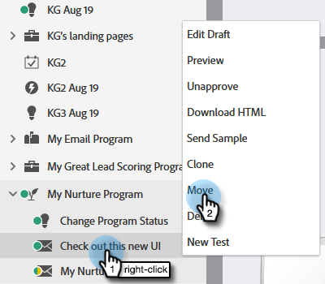

# 자산 이동 중 {#moving-assets}

현재 드래그 앤 드롭을 사용할 수 없지만 에셋을 손쉽게 재배치할 수 있습니다.

>[!NOTE]
>
>Design Studio의 폴더는 동일한 작업 영역 내에서 이동할 수 있지만 지금은 작업 영역 간에 이동할 수는 없습니다.

1. 트리에서 이동할 자산을 찾습니다. 마우스 오른쪽 단추를 클릭하고 **이동**&#x200B;을 선택합니다.

   

1. 대상 섹션을 선택합니다.

   

>[!NOTE]
>
>이 양식의 후속 옵션은 선택한 **대상**&#x200B;에 따라 변경될 수 있습니다.

1. 대상 폴더를 선택합니다.

   

1. **이동**&#x200B;을 클릭합니다.

   

간단합니다!
