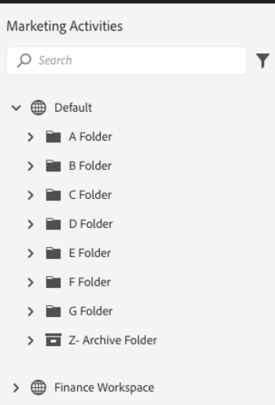

# 개요 {#overview}

Marketing To 플랫폼 전반에서 새로운 모양과 느낌과 함께 유용성을 향상시켜주는 새로운 인터페이스인 차세대 Marketo Engage 경험에 오신 것을 환영합니다.

>[!PREREQUISITES]
>
>IT 팀에서를 사용하여 웹 액세스를 제한하는 경우 모든 Marketing To 리소스 및 웹 소켓을 허용하도록 다음 도메인(별표 포함)을 추가하도록 요청하십시오.
>
>* *.marketing.com
>* *.marketodesigner.com
>* *.mktoweb.com

## 둘러보기 {#take-the-tour}

처음 로그인하면 새 경험의 런다운을 제공할 준비가 된 팝업이 표시됩니다. 주의하십시오. 건너뛸 경우 나중에 **을(를) 사용할 수 없게 됩니다.**

관광은 여러분이 알아야 할 모든 것을 안내합니다!

## 새로운 기능 {#whats-new}

이 차세대 경험에 새로운 기능이 많이 추가되었으며 이 모든 기능은 마케팅 경험을 크게 향상시키도록 설계되었습니다.

**아이콘**

새로운 인터페이스에서는 아이콘 획이 개선되고 확장되었습니다. 여기에서 이러한 기능에 대해 자세히 알아보십시오.[새 아이콘 용어집](/help/marketo/product-docs/marketo-engage-next-generation-experience/new-icon-glossary.md).

**트리**

나무도 업그레이드되었습니다. 하지만 지금은 드래그 앤 드롭을 사용할 수 없습니다. 그러나 에셋을 이동할 수는 있습니다. 방법 살펴보기:[자산 이동](/help/marketo/product-docs/marketo-engage-next-generation-experience/moving-assets.md).

**전역 탐색**

안녕 슈퍼볼 이제 모든 기본 마케팅 섹션에 빠르게 액세스할 수 있습니다.

**인스턴스 URL**

또한 이제 인스턴스의 URL에 반영되는 공유 ID에 빠르게 액세스할 수 있습니다(여러 구독이 있는 사람에게 더 도움이 됨).

## 새 트리 옵션 {#new-tree-options}

이용 가능한 새로운 트리 기능은 매우 많습니다.

**Marketing Classic vs. New Marketing**

<table> 
 <tbody>
  <tr>
   <th>기능</th> 
   <th>클래식</th> 
   <th>차세대</th> 
  </tr>
  <tr>
   <td>여러 필터를 동시에 적용</td> 
   <td></td> 
   <td><strong>X</strong></td>  
  </tr>
  <tr>
   <td>결합된 초안 및 승인 트리 노드</td> 
   <td></td> 
   <td><strong>X</strong></td> 
  </tr>
  <tr>
   <td>프로그램 폴더에 로컬 에셋 만들기</td> 
   <td></td> 
   <td><strong>X</strong></td> 
  </tr>
  <tr>
   <td>트리 노드를 확장/축소하려면 두 번 클릭</td> 
   <td><strong>X</strong></td> 
   <td><strong>X</strong></td>  
  </tr>
  <tr>
   <td>트리에서 참여 스트림으로 드래그 앤 드롭</td> 
   <td><strong>X</strong></td> 
   <td>hhhhhhhh</td> 
  </tr>
  <tr>
   <td>트리 안쪽으로 드래그하여 놓기</td> 
   <td><strong>X</strong></td> 
   <td></td> 
  </tr>
  <tr>
   <td>자산 유형 및 상태별로 필터링</td> 
   <td><i>partial</i></td> 
   <td><strong>X</strong></td>  
  </tr>
  <tr>
   <td>초점 상태의 계층을 표시하기 위해 배경 강조 표시</td> 
   <td></td> 
   <td><strong>X</strong></td> 
  </tr>
  <tr>
   <td>검색 중 키워드 강조 표시</td> 
   <td></td> 
   <td><strong>X</strong></td> 
  </tr>
  <tr>
   <td>가로 스크롤</td> 
   <td><strong>X</strong></td> 
   <td><strong>X</strong></td>  
  </tr>
  <tr>
   <td>트리 노드의 커서 놓기 상태</td> 
   <td><strong>X</strong></td> 
   <td><strong>X</strong></td> 
  </tr>
  <tr>
   <td>전체 트리를 신속하게 축소</td> 
   <td></td> 
   <td><strong>X</strong></td> 
  </tr>
  <tr>
   <td>신속하게 루트 노드로 축소</td> 
   <td></td> 
   <td><strong>X</strong></td>  
  </tr>
  <tr>
   <td>실시간 업데이트</td> 
   <td></td> 
   <td><strong>X</strong></td> 
  </tr>
  <tr>
   <td>크기 조정 가능한 트리</td> 
   <td><strong>X</strong></td> 
   <td><strong>X</strong></td> 
  </tr>
  <tr>
   <td>보관된 폴더에서 검색</td> 
   <td></td> 
   <td><strong>X</strong></td>  
  </tr>
  <tr>
   <td>트리 검색에서 전역 검색을 입력할 때 저장된 검색 문자열</td> 
   <td></td> 
   <td><strong>X</strong></td> 
  </tr>
  <tr>
   <td>단일 트리에 모든 작업 영역 표시</td> 
   <td><strong>X</strong></td> 
   <td><strong>X</strong></td> 
  </tr>
  <tr>
   <td>상태 배지 및 툴팁</td> 
   <td></td> 
   <td><strong>X</strong></td>  
  </tr>
  <tr>
   <td>'다음으로 단어 시작' 검색 논리</td> 
   <td><strong>X</strong></td> 
   <td><strong>X</strong></td> 
  </tr>
 </tbody>
</table>

## 전역 탐색 {#global-nav}

새로운 전역 탐색 기능을 살펴보십시오.

<table> 
 <tbody>
  <tr>
   <td>3</td> 
   <td>더 이상 슈퍼볼 드롭다운 없음</td> 
  </tr>
  <tr>
   <td>2</td> 
   <td>나열된 모든 이전 슈퍼볼 항목</td> 
  </tr>
  <tr>
   <td>1</td> 
   <td>MEUE 경험에 대한 피드백을 제공할 수 있습니다.</td> 
  </tr>
  <tr>
   <td>4</td> 
   <td>여러 구독이 있는 경우 하위 이름을 클릭하여 다른 구독으로 쉽게 전환합니다</td> 
  </tr>
  <tr>
   <td>5</td> 
   <td>전역 검색 - 이제 여기에서 전체 인스턴스를 검색할 수 있습니다.</td> 
  </tr>
 </tbody>
</table>

>[!NOTE]
>
>수퍼볼 드롭다운에서 사용하던 모든 것을 내 마케팅의 타일로 계속 사용할 수 있습니다.

>[!TIP]
>
>트리에서 검색을 사용하면 현재 있는 섹션(예: 마케팅 활동)의 결과만 산출됩니다. 전체 인스턴스를 검색하려면 전역 검색을 사용합니다.

새로운 Marketo Engage 경험을 즐기고 피드백을 공유하십시오!
