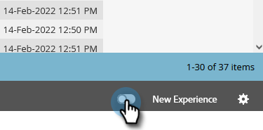
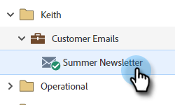

# 스위치 전환 {#toggle-switch}

전환 스위치를 사용하면 Marketo의 클래식 인터페이스와 차세대 Marketo Engage 경험 간에 전환할 수 있습니다. 이 기능은 아래에 강조 표시된 모든 영역에서 사용할 수 있습니다. 2022년 5월 릴리스부터 차세대 경험은 기본적으로 활성화됩니다.

>[!NOTE]
>
>전환 스위치를 선택하면 UI 변경 사항이 발생하기 전에 기존의 모든 워크플로우가 자동으로 저장됩니다. 작업이 이미 진행 중인 경우(예: 자산이 승인되는 중), 이와 같이 표시되는 오류 메시지가 표시되며 작업이 완료된 후 다시 시도하십시오.

## 개별 역할에 대해 전환 스위치 활성화 {#enable-the-toggle-switch-for-individual-roles}

개별 역할 또는 모든 역할에 대해 전환 스위치를 활성화합니다. 방법은 다음과 같습니다.

1. Marketo Engage에서 **관리**.

   

1. 클릭 **새 경험**.

   

1. 전환 스위치에 액세스할 역할을 선택합니다.

   

## 랜딩 페이지 목록 보기 {#landing-page-list-view}

차세대 랜딩 페이지 목록 보기에는 검색 필터와 대량 랜딩 페이지 작업을 수행하는 기능이 제공됩니다.

1. Marketo에서 **Design Studio**.

   

1. 선택 **랜딩 페이지**.

   

1. 페이지 오른쪽 아래에서 **새 경험** 토글.

   

새 경험이 로드됩니다.

## 랜딩 페이지 세부 사항 보기 {#landing-page-details-view}

1. Marketo에서 랜딩 페이지를 찾아서 선택합니다.

   

1. 페이지 오른쪽 아래에서 **새 경험** 토글.

   

새 경험이 로드됩니다.

## 양식 세부 사항 페이지 {#form-details-page}

1. Marketo에서 양식을 찾아 선택합니다.

   

1. 페이지 오른쪽 아래에서 **새 경험** 토글.

   

새 경험이 로드됩니다.

## 양식 목록 보기 {#form-list-view}

1. Marketo에서 **Design Studio**.

   

1. 선택 **Forms**.

   

1. 페이지 오른쪽 아래에서 **새 경험** 토글.

   

새 경험이 로드됩니다.

## 이메일 템플릿 세부 사항 보기 {#email-template-details-view}

1. Marketo에서 **Design Studio**.

   

1. 원하는 이메일 템플릿을 선택합니다.

   

1. 페이지 오른쪽 아래에서 **새 경험** 토글.

   

새 경험이 로드됩니다.

## 전자 메일 세부 사항 보기 {#email-details-view}

1. Marketo에서 이메일을 찾아 선택합니다.

   

1. 페이지 오른쪽 아래에서 **새 경험** 토글.

   

새 경험이 로드됩니다.

## 전자 메일 목록 보기 {#email-list-view}

차세대 이메일 목록 보기는 검색 필터와 대량 이메일 작업을 수행하는 기능을 제공합니다.

1. Marketo에서 **Design Studio**.

   

1. 선택 **이메일**.

   

1. 페이지 오른쪽 아래에서 **새 경험** 토글.

   

새 경험이 로드됩니다.

## 모든 기능에 대해 활성화 {#enable-for-all-features}

사용 가능한 모든 기능, 현재 및 제공 상태에 대해 Marketo의 차세대 인터페이스를 수동으로 활성화하는 옵션이 있습니다.

1. 현재 전환 스위치가 있는 영역에서(이 예에서는) [양식 세부 사항 페이지](#form-details-page))의 경우 페이지 오른쪽 하단에 있는 톱니바퀴 아이콘을 클릭합니다.

   

1. 선택 **사용 가능한 모든 기능에 대해 활성화** 을(를) 클릭합니다. **확인**.

   
