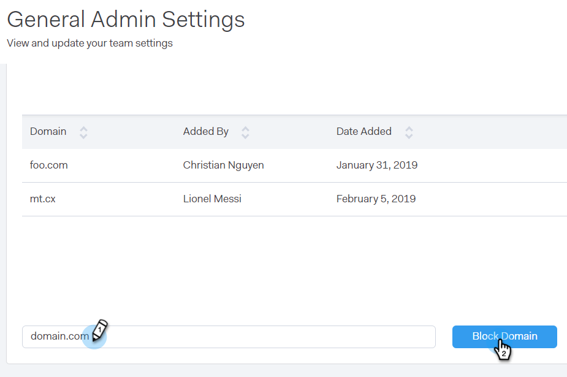

# 차단된 도메인 {#blocked-domains}

실수로 경쟁업체와 스팸을 신고하거나 정보를 노출시키지 않는 다른 도메인의 이메일 전송을 통해 성공적인 마케팅을 전개할 수 있습니다.

>[!NOTE]
>
>**관리자 권한 필요**

1. 웹 응용 프로그램에서 톱니바퀴 아이콘을 클릭하고 **설정**&#x200B;을 선택합니다.

   

1. 관리 설정에서 **일반을 클릭합니다.**

   

1. 차단하려는 도메인을 입력하고 **블록 도메인**&#x200B;을 클릭합니다.

   

   >[!NOTE]
   >
   >차단된 전자 메일 도메인으로 전송되지 못하는 [그룹 전자 메일](http://docs.marketo.com/x/KAQ6Ag) 보내기에 포함된 이메일은 자동으로 실패하며 실패한 전자 메일 폴더에 표시되지 않습니다.

