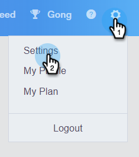
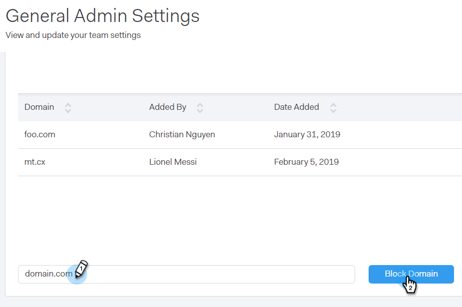

# 차단된 도메인 {#blocked-domains}

경쟁업체, 알려진 스팸 트랩 또는 연락을 원치 않는 다른 도메인에 실수로 이메일을 보내는 것을 방지하여 영업 팀이 성공할 수 있도록 지원합니다.

>[!NOTE]
>
>**관리자 권한 필요**

1. 웹 응용 프로그램에서 톱니바퀴 아이콘을 클릭하고 **[!UICONTROL Settings]**&#x200B;을(를) 선택합니다.

   

1. [!UICONTROL Admin Settings]에서 **[!UICONTROL General]**&#x200B;을(를) 클릭합니다.

   

1. 차단하려는 도메인을 입력하고 **[!UICONTROL Block Domain]**&#x200B;을(를) 클릭합니다.

   

   >[!NOTE]
   >
   >차단된 전자 메일 도메인으로 보내져 실패한 [그룹 전자 메일](/help/marketo/product-docs/marketo-sales-connect/email/using-the-compose-window/sending-emails-via-group-email.md) 메일의 일부 전자 메일은 자동으로 실패하고 실패한 전자 메일 폴더에 표시되지 않습니다.
