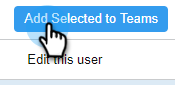

# 하위 팀 만들기 {#create-a-sub-team}

## 하위 팀 만들기 {#create-a-sub-team-1}

1. 톱니바퀴 아이콘을 클릭하고 **[!UICONTROL Settings]**&#x200B;을(를) 선택합니다.

   

1. [!UICONTROL Admin Settings]에서 **[!UICONTROL Team Management]**&#x200B;을(를) 선택합니다.

   

1. [!UICONTROL All Teams] 옆에 있는 **+**&#x200B;을(를) 클릭합니다.

   

1. 팀 이름(및 설명(선택 사항)을 입력하고 **[!UICONTROL Create]**&#x200B;을(를) 클릭합니다.

   

   >[!NOTE]
   >
   >이제 템플릿, 캠페인 및 그룹을 해당 팀과 공유할 수 있습니다.

## 하위 팀에 사람 추가 {#add-people-to-your-sub-team}

1. [!UICONTROL Team Management]에서 **[!UICONTROL Everyone]** 그룹을 선택하십시오.

   

1. 하위 팀에 추가할 사용자를 찾아 해당 확인란을 선택합니다.

   

1. **[!UICONTROL Add Selected to Teams]**&#x200B;를 클릭합니다.

   

1. 드롭다운을 클릭하고 원하는 팀을 선택합니다.

   

1. 완료되면 **[!UICONTROL Add To Teams]**&#x200B;을(를) 클릭합니다.

   
