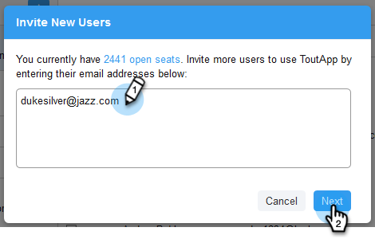

# 사용자 초대 {#invite-users}

사용자를 추가하는 것은 빠르고 쉽습니다!

1. 톱니바퀴 아이콘을 클릭하고 **[!UICONTROL Settings]**&#x200B;을(를) 선택합니다.

   

1. [!UICONTROL Admin Settings]에서 **[!UICONTROL User Management]**&#x200B;을(를) 선택합니다.

   

1. **[!UICONTROL Invite Users]**&#x200B;를 클릭합니다.

   

1. 추가할 개인의 전자 메일 주소를 입력하고 **[!UICONTROL Next]**&#x200B;을(를) 클릭합니다.

   

   >[!NOTE]
   >
   >기본적으로 모든 새 멤버가 모든 사용자 팀에 추가됩니다.

1. **[!UICONTROL OK]**&#x200B;를 클릭합니다.

   
