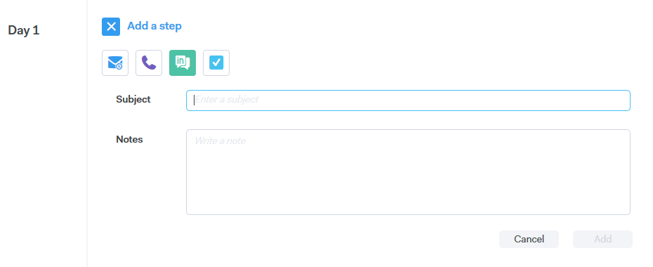

# 캠페인 단계 유형 {#campaign-step-types}

캠페인에 단계를 추가하면 네 가지 옵션이 제공됩니다.

## 이메일 {#email}

새 이메일을 작성하거나 기존 템플릿을 사용합니다.

| **템플릿 사용** | 기존 템플릿 중 하나 선택 |
|---|---|
| **템플릿으로 저장** | 방금 작성한 이메일을 새 템플릿으로 저장합니다. |
| **콘텐츠 추가** | 파일을 서버에 업로드하고 이메일에서 추적할 수 있는 URL(콘텐츠를 가리킴)을 수신합니다. |
| **파일 첨부** | 컴퓨터에서 이메일에 파일 첨부(23MB 크기 제한) |

>[!TIP]
>
>[전송 옵션](/help/marketo/product-docs/marketo-sales-connect/campaigns/understanding-send-options.md)에 대한 세부 정보를 알아보세요.

## 콜 {#call}

전화를 통한 연락처에 대한 후속 조치를 취하도록 미리 알림을 설정합니다. 통화 중에 통화 트랙으로 사용할 메모를 저장할 수도 있습니다.

## InMail {#inmail}

여러 채널에서 추적하는 것은 리드와 연결하는 좋은 방법입니다. InMail 작업을 사용하면 미리 알림을 설정하여 [!DNL LinkedIn]을(를) 통해 연락할 수 있습니다.

## 사용자 정의 작업 {#custom-task}

위의 옵션을 적용할 수 없을 때 사용자 지정 작업을 활용합니다. 예를 들어, 이메일을 통해 잠재 고객을 후속 조치하도록 동료를 초대할 수 있습니다.

