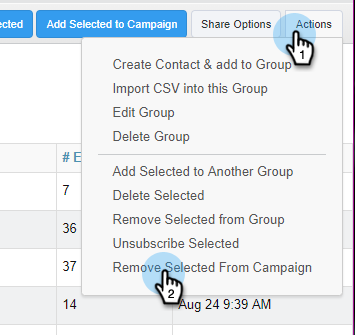

# 캠페인에서 인물 제거 {#remove-people-from-a-campaign}

수신자가 회신하면 캠페인을 자동으로 종료할 수 있습니다. 또한 캠페인을 해당 수신자에 대한 &#39;성공&#39;으로 표시하도록 선택할 수 있습니다.

캠페인을 만든 후 이를 설정하려면 캠페인 탭의 설정 부분에 있는 가입 해지 상자를 선택하면 됩니다. 이 두 옵션 모두 캠페인이 종료되고 수신자가 귀하로부터 더 이상 이메일을 받지 않게 됩니다. 이 작업을 수행하려면 회신 추적 기능이 있어야 합니다.

또한 캠페인 자체에서 사용자를 제거하고, 사람 페이지 내의 캠페인에서 사람을 제거하고, 전체 그룹의 구성원을 제거할 수 있습니다. 아래의 세 가지 방법을 살펴봅시다.

## 캠페인에서 직접 사람 제거 {#remove-a-person-directly-from-a-campaign}

1. Sales Connect에서 **캠페인** 탭을 클릭합니다.

   

1. 캠페인을 찾아 선택합니다.

   

1. 캠페인이 오른쪽에 나타납니다. 아무 곳이나 클릭하여 엽니다.

   

1. 제거할 사람을 찾아 **제거를 클릭합니다**.

   

1. (선택 사항 단계) 이름 옆의 확인란을 클릭하고 맨 위에 있는 **제거** 단추를 클릭하여 여러 사람을 한 번에 제거할 수도 있습니다.

   

## 사람 페이지 내의 캠페인에서 인물 제거 {#remove-a-person-from-a-campaign-within-the-people-page}

1. Sales Connect에서 **사람** 탭을 클릭합니다.

   

1. 제거할 사람을 찾아 선택합니다.

   

1. 오른쪽에 사람 세부 사항 보기 패널이 열립니다. [ **작업 내역** ] 탭 뒤에 [ **제거] 단추를** 클릭합니다.

   

## 캠페인에서 사용자 그룹 제거 {#remove-a-group-of-people-from-a-campaign}

1. Sales Connect에서 **사람** 탭을 클릭합니다.

   

1. 내 그룹 **에서 그룹을 찾아 선택합니다**.

   

1. 제거할 사람을 선택합니다.

   

1. 작업 **을** 클릭하고 **캠페인에서 선택한 항목 제거를 선택합니다**.

   

