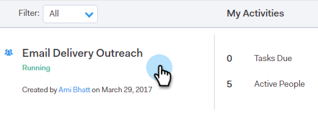

# 캠페인에서 사용자 제거 {#remove-people-from-a-campaign}

수신자가 답장을 보내면 자동으로 캠페인을 종료할 수 있습니다. 또한 해당 수신자를 위한 &#39;성공&#39;으로 캠페인을 표시하도록 선택할 수 있습니다.

이를 설정하려면 캠페인을 만든 후 [!UICONTROL Unsubscribe] 탭의 [!UICONTROL Settings] 부분에서 [!UICONTROL Campaigns] 상자를 선택하면 됩니다. 이 두 옵션 모두 캠페인을 종료하며 수신자는 더 이상 귀하로부터 이메일을 받지 않습니다. 이 작업을 수행하려면 회신 추적이 있어야 합니다.

또한 캠페인 자체에서 사람을 제거하고, 사람 페이지 내에서 캠페인에서 사람을 제거하고, 전체 사람 그룹을 제거할 수 있습니다. 아래의 세 가지 방법을 모두 살펴보자.

## 캠페인에서 직접 사람 제거 {#remove-a-person-directly-from-a-campaign}

1. [!DNL Sales Connect]에서 **[!UICONTROL Campaigns]** 탭을 클릭합니다.

   

1. 캠페인을 찾아 선택합니다.

   

1. 캠페인이 오른쪽에 나타납니다. 아무 곳이나 클릭하여 엽니다.

   

1. 제거할 사람을 찾은 다음 **[!UICONTROL Remove]**&#x200B;을(를) 클릭합니다.

   

1. (선택 사항 단계) 이름 옆의 확인란을 클릭하고 맨 위의 **[!UICONTROL Remove]** 단추를 클릭하여 여러 사람을 한 번에 제거할 수도 있습니다.

   

## 인물 페이지 내의 캠페인에서 인물 제거 {#remove-a-person-from-a-campaign-within-the-people-page}

1. [!DNL Sales Connect]에서 **[!UICONTROL People]** 탭을 클릭합니다.

   

1. 제거할 사람을 찾아 선택합니다.

   

1. 오른쪽에 개인 세부 사항 보기 패널이 열립니다. **[!UICONTROL History]** 탭 다음에 **[!UICONTROL Remove]** 단추를 클릭합니다.

   

## 캠페인에서 사람 그룹 제거 {#remove-a-group-of-people-from-a-campaign}

1. [!DNL Sales Connect]에서 **[!UICONTROL People]** 탭을 클릭합니다.

   

1. **[!UICONTROL My Groups]**&#x200B;에서 내 그룹을 찾아 선택합니다.

   

1. 제거할 사람을 선택합니다.

   

1. **[!UICONTROL Actions]**&#x200B;을(를) 클릭하고 **[!UICONTROL Remove Selected From Campaign]**&#x200B;을(를) 선택합니다.

   
