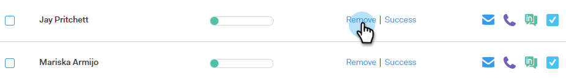

# 캠페인에서 사용자 제거 {#remove-people-from-a-campaign}

수신자가 답장할 때 캠페인을 자동으로 종료할 수 있습니다. 또한 해당 수신자에 대해 캠페인을 &#39;성공&#39;으로 표시하도록 선택할 수 있습니다.

캠페인을 만든 후 캠페인 탭의 설정 부분에서 가입 해지 상자를 선택하면 됩니다. 이 두 옵션 모두 캠페인을 종료하며 수신자가 더 이상 본인으로부터 이메일을 받지 않게 됩니다. 이를 수행하려면 회신 추적이 있어야 합니다.

또한 캠페인 자체에서 사용자를 제거하고 사람 페이지 내의 캠페인에서 사용자를 제거하고 전체 사용자 그룹을 제거할 수 있습니다. 아래의 세 가지 방법을 살펴봅시다.

## 캠페인에서 직접 개인 제거 {#remove-a-person-directly-from-a-campaign}

1. Sales Connect에서 **캠페인** 탭.

   

1. 캠페인을 찾아 선택합니다.

   

1. 캠페인이 오른쪽에 나타납니다. 아무 곳이나 클릭하여 엽니다.

   

1. 제거할 사람을 찾아 **제거**.

   

1. (선택 사항 단계) 이름 옆에 있는 확인란을 클릭하고 을 클릭하여 여러 사용자를 한 번에 제거할 수도 있습니다 **제거** 단추를 클릭합니다.

   

## 사람 페이지 내에서 캠페인에서 개인 제거 {#remove-a-person-from-a-campaign-within-the-people-page}

1. Sales Connect에서 **사람** 탭.

   

1. 제거할 사람을 찾아 선택합니다.

   

1. 개인 세부 사항 보기 패널이 오른쪽에 열립니다. 을(를) 클릭합니다. **기록** 탭 다음에 **제거** 버튼을 클릭합니다.

   

## 캠페인에서 사용자 그룹 제거 {#remove-a-group-of-people-from-a-campaign}

1. Sales Connect에서 **사람** 탭.

   

1. 아래에서 그룹 찾기 및 선택 **내 그룹**.

   

1. 제거할 사람을 선택합니다.

   

1. 클릭 **작업** 및 **Campaign에서 선택한 항목 제거**.

   
