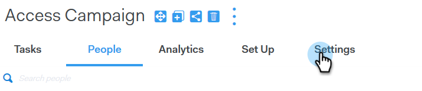
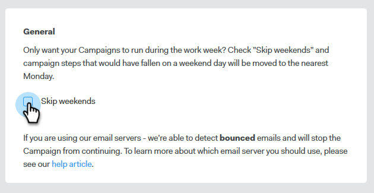

# 주말 건너뛰기 {#skip-weekends}

캠페인을 자동화할 때, 토요일 또는 일요일에 발송하는 이메일을 사용하지 않을 수도 있습니다. 그렇지 않다면, 당신은 주말을 거르지 않아도 된다.

1. Sales Connect에서 캠페인 탭을 클릭합니다.

   

1. 캠페인을 찾아 선택합니다.

   

1. **설정**&#x200B;을 클릭합니다.

   

1. **주말 건너뛰기** 확인란을 선택합니다.

   

   >[!NOTE]
   >
   >주말 없이 이메일은 7일 주기로 예약됩니다.

