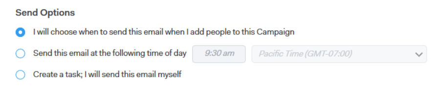

# 전송 옵션 이해 {#understanding-send-options}

캠페인을 만들 때 [!DNL Sales Connect]에서 이메일 단계를 만드는 방법에 대한 몇 가지 옵션이 있습니다. 또한 Campaign에서 이메일이 어디에 포함되는지에 따라 옵션도 달라집니다.

첫 번째 단계이고 Campaign의 첫 번째 날인 경우 다음 옵션이 제공됩니다.

**이 전자 메일을 보낼 시기를 선택합니다**

* 이 옵션을 사용하면 사람을 추가하여 Campaign을 시작할 때 Campaign에서 첫 번째 이메일에 대해 &quot;전송 시간&quot;을 선택할 수 있습니다.

**다음 시간에 이 전자 메일 보내기**

* 사용자를 추가하여 Campaign을 시작하면 이 시간으로 이메일을 예약합니다.
* Campaign을 시작할 때 새로운 &quot;전송 시간&quot;을 선택할 수 있는 옵션은 항상 있습니다.

**작업을 만듭니다. 이 전자 메일을 직접 보내겠습니다**

* 이 옵션을 사용하면 편한 시간에 보낼 수 있는 [!UICONTROL Email Task]이(가) 만들어지고 [!DNL Salesforce]과(와) 동기화됩니다.
* 이 옵션을 선택하면 Campaign을 시작할 때 명령 센터 및 라이브 피드에 해당 작업을 큐에 추가합니다. 그런 다음 각 이메일이 발송되기 전에 개인화하고 전송(또는 예약)할 수 있습니다.

   * 웹 애플리케이션에서 이 작업을 열면 연락처의 이메일 주소, 이메일의 제목 줄 및 선택한 템플릿이 있는 작성 창이 열립니다.
   * [!DNL Gmail] 또는 [!DNL Outlook]에서 이 작업을 열면 기본 작성 창이 열리고 연락처 전자 메일 주소, 전자 메일의 제목 줄 및 선택한 템플릿이 동적으로 채워집니다.

Campaign의 이후 며칠/단계에서는 다음 옵션을 사용할 수 있습니다.

**이 Campaign에서 이전 전자 메일과 동시에 이 전자 메일을 보냅니다**

* 이 옵션은 바로 전의 이메일과 동시에 이메일을 전송합니다.
* 연결된 날짜에 계속 전송됩니다.

>[!IMPORTANT]
>
>같은 날 전송된 이메일에는 이전 이메일과 동시에 이메일을 보내는 것이 지원되지 않습니다. 대신 전날부터 전송된 시점에 이메일이 발송된다. 캠페인의 첫날 이메일에 대해 이 옵션을 선택하면(권장되지 않음) 캠페인 시작 시 해당 이메일이 즉시 전송됩니다.

**다음 시간에 이 전자 메일 보내기**

* 사용자를 추가하여 Campaign을 시작하면 이 시간으로 이메일을 예약합니다.
* Campaign을 시작할 때 새로운 &quot;전송 시간&quot;을 선택할 수 있는 옵션은 항상 있습니다.

**작업을 만듭니다. 이 전자 메일을 직접 보내겠습니다**

* 이 옵션을 사용하면 편한 시간에 보낼 수 있는 [!UICONTROL Email Task]이(가) 만들어지고 [!DNL Salesforce]과(와) 동기화됩니다.
* 이 옵션을 선택하면 캠페인을 시작할 때 Tout이 이러한 작업을 명령 센터 및 라이브 피드에 자동으로 큐에 추가합니다. 그런 다음 각 이메일이 발송되기 전에 개인화하고 전송(또는 예약)할 수 있습니다.

   * 웹 애플리케이션에서 이 작업을 열면 연락처의 이메일 주소, 이메일의 제목 줄 및 선택한 템플릿이 있는 작성 창이 열립니다.
   * [!DNL Gmail] 또는 [!DNL Outlook]에서 이 작업을 열면 기본 작성 창이 열리고 연락처 전자 메일 주소, 전자 메일의 제목 줄 및 선택한 템플릿이 동적으로 채워집니다.

**이 전자 메일을 이전 전자 메일로 스레드**

* 이 전송 옵션은 이전 이메일의 &#39;후속 작업&#39;이 되며 이전 이메일 본문을 이 이메일 하단에 추가합니다.

