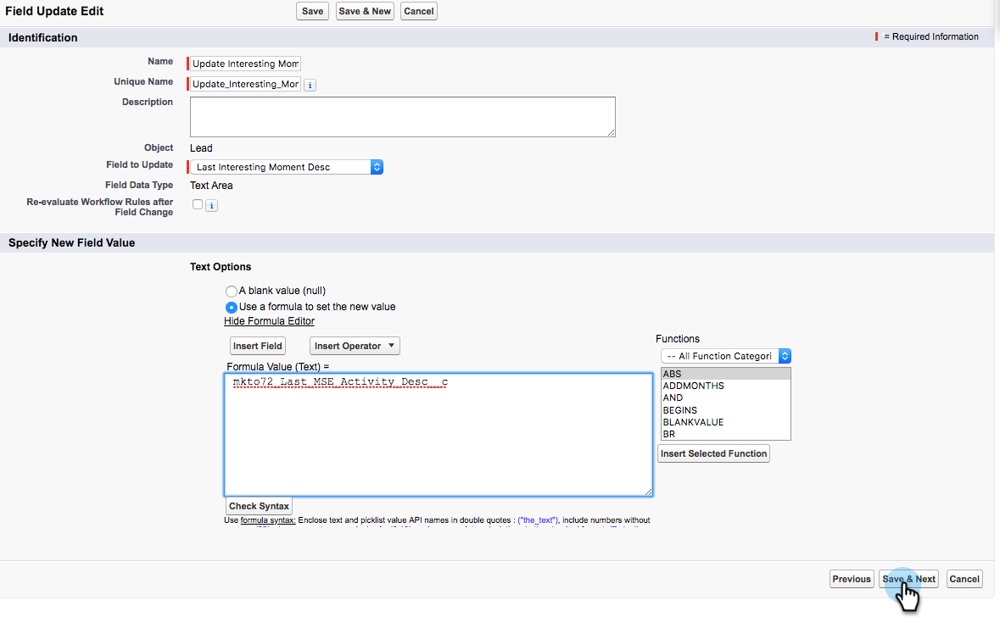

# Salesforce에서 워크플로우 규칙 만들기 {#creating-workflow-rules-in-salesforce}

Marketing To Sales Insight(MSI) 및 Marketing To Sales Connect(MSC)를 동시에 사용하는 경우 Salesforce의 MSI Best Beting 기능이 업데이트되지 않습니다. 다른 모든 MSI 기능은 평소대로 작동합니다(iFrame에서 흥미로운 시간 보기, 이메일 보내기, 캠페인에 추가 등). 이 문서에서는 최상의 선택이 다시 작동하도록 하는 해결 방법을 제공합니다.

>[!NOTE]
>
>이는 MSI와 MSE를 **모두** 사용하고 있고 MSI에서 최상의 선택 기능을 사용하려는 고객에게만 영향을 줍니다. 최고의 베팅을 필요/사용하지 않으면 무시해도 됩니다.

## 시작하기 {#getting-started}

이 해결 방법에는 새 MSE 필드의 값을 이전 MSI 필드로 복사하는 새 워크플로 규칙을 만드는 것이 포함됩니다. 연락처 개체에 대한 4개의 워크플로우 규칙과 고유한 Salesforce 인스턴스에 있는 리드 개체에 대한 동일한 4개의 워크플로우 규칙을 만들어야 합니다. CRM 관리 권한이 필요할 수 있습니다(CRM의 역할 및 설정에 따라).

다음은 워크플로우 규칙의 권장 이름 및 각 규칙의 설명입니다. 연락처 및 리드 개체에 적용됩니다.

<table> 
 <colgroup> 
  <col> 
  <col> 
 </colgroup> 
 <tbody> 
  <tr> 
   <td>관심 모멘트 설명 필드 업데이트</td> 
   <td>
복사 위치:마지막 마케팅 참여 설명 복사 대상:마지막 관심 모멘트 설명
</td> 
  </tr> 
  <tr> 
   <td>관심 모멘트 유형 업데이트 필드</td> 
   <td>
복사 위치:마지막 마케팅 참여 유형복사 대상:마지막 흥미로운 순간 유형
</td> 
  </tr> 
  <tr> 
   <td>관심 모멘트 소스 필드 업데이트</td> 
   <td>
복사 위치:마지막 마케팅 참여 소스 복사 대상:마지막 흥미로운 순간 출처
</td> 
  </tr> 
  <tr> 
   <td>관심 모멘트 날짜 필드 업데이트</td> 
   <td>
복사 위치:마지막 마케팅 참여 날짜복사 대상:마지막 흥미로운 순간 날짜
</td> 
  </tr> 
 </tbody> 
</table>

## 지침 {#instructions}

1. 설정을 **클릭한**&#x200B;후 **Workflow를** 검색하고 **Workflow 규칙**&#x200B;을선택합니다.

   

1. 새 **규칙을 선택합니다**.

   

1. 개체 드롭다운을 클릭하고 **리드**&#x200B;를 선택한 다음 **다음을 클릭합니다**.

   

1. 규칙 이름으로 &quot;관심 있는 순간 설명 필드 업데이트&quot;를 입력합니다. 만든 라디오 단추 **를 선택하고 편집할**&#x200B;때마다 선택합니다. 규칙 기준 드롭다운 목록에서 **공식을 true로 평가합니다**. ISCHANGED 함수를 검색하고 선택합니다. 그런 다음 기본 필드 값을 강조 표시한 다음 필드 **삽입을 클릭합니다**.

   

1. &quot;필드 삽입&quot; 팝업에서 **마지막 마케팅 대상 참여** 설명을 선택하고 **삽입을 클릭합니다**.

   

1. 저장 **및 다음을 클릭합니다**.

   

1. 워크플로우 작업 추가 드롭다운에서 **새 필드 업데이트를 선택합니다**.

   

1. 이름 필드에 &quot;관심 있는 모멘트 설명 필드 업데이트&quot;를 입력합니다(고유 이름이 자동으로 생성됩니다). 업데이트할 필드 드롭다운에서 **마지막 관심 영역 설명**&#x200B;을 선택합니다. 공식 **사용을 사용하여 새 값** 라디오 단추를 선택한 다음 공식 편집기 **표시를 클릭합니다**.

   

1. 필드 **삽입** 단추를 클릭합니다.

   

1. 마지막 **마케팅 대상 참여**&#x200B;설명을 선택하고 삽입을 **클릭합니다**. 다음 페이지에서 저장을 **클릭합니다**.

   

1. 완료를 **클릭합니다**.

   

1. 활성화 **를** 클릭하여 워크플로우 규칙을 활성화합니다.

   

   마지막 단계 후에는 시작 섹션에 나열된 다른 필드에 대해 워크플로우 규칙을 복제하도록 선택할 수 있습니다.설명, 유형, 출처, 일자. 연락처 개체에서 네 개의 워크플로우 규칙을 완료한 후 리드 개체에 대해 동일한 작업을 반복합니다.

