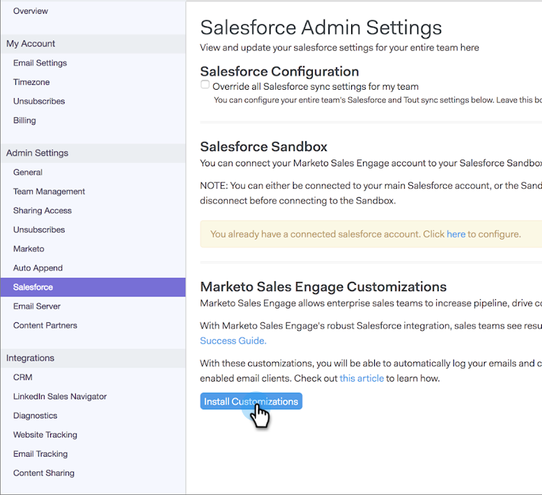

# Salesforce Sandbox에 사용자 정의 설치하는 방법 {#how-to-install-customizations-in-your-salesforce-sandbox}

>[!NOTE]
>
>**관리자 권한 필요**

>[!PREREQUISITES]
>
>[Salesforce 샌드박스에 판매 연결](/help/marketo/product-docs/marketo-sales-connect/crm/salesforce-customization/how-to-connect-sales-connect-to-your-salesforce-sandbox.md)

1. [!DNL Sales Connect]에서 오른쪽 상단의 톱니바퀴 아이콘을 클릭하고 **[!UICONTROL Settings]**&#x200B;을(를) 선택합니다.

   

1. [!UICONTROL Admin Settings]에서 **[!UICONTROL Salesforce]**&#x200B;을(를) 클릭합니다.

   

1. **[!UICONTROL Install Customizations]**&#x200B;를 클릭합니다.

   

   그런 다음 일반 [!DNL Salesforce] 계정에서와 마찬가지로 사용자 지정을 설치하는 단계를 거칩니다.
