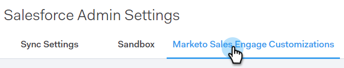
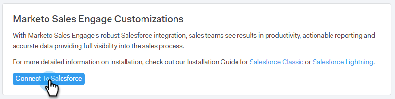

# CRM용 [!DNL Sales Connect] 사용자 지정 {#sales-connect-customizations-for-crm}

아래 필드와 단추는 Salesforce CRM의 메타데이터 API에 의해 만들어집니다. 필드가 만들어지면 관리자는 해당 CRM에서 페이지 레이아웃을 구성하여 표시해야 합니다. 지침 [은(는) 여기에서 찾을 수 있습니다](/help/marketo/product-docs/marketo-sales-connect/crm/salesforce-customization/assets/mse-for-sf-classic.pdf).

## [!DNL Salesforce]에서 사용자 지정을 설치하는 방법 {#how-to-install-customizations-in-salesforce}

1. [!DNL Sales Connect]에서 톱니바퀴 아이콘을 클릭하고 **[!UICONTROL Settings]**&#x200B;을(를) 선택합니다.

   

1. [!UICONTROL Admin Settings]에서 **[!UICONTROL Salesforce]**&#x200B;을(를) 선택합니다.

   

1. **[!UICONTROL Marketo Sales Engage Customizations]**&#x200B;을(를) 클릭합니다.

   

1. **[!UICONTROL Connect to Salesforce]**&#x200B;을(를) 클릭합니다.

   

1. [!DNL Salesforce]에 로그인합니다.

   

## [!DNL Salesforce] 사용자 지정 업데이트 {#update-salesforce-customization}

[!DNL Salesforce] 사용자 지정 패키지에 대한 업데이트에는 개선 사항 및 버그 수정이 포함됩니다. 업데이트를 사용할 수 있는지 확인하거나 업데이트를 수행하려면 아래 단계를 따르십시오.

>[!NOTE]
>
>**관리자 권한이 필요합니다.**

1. [웹 응용 프로그램](https://www.toutapp.com)에서 톱니바퀴 아이콘을 클릭하고 **[!UICONTROL Settings]**&#x200B;을(를) 선택합니다.

   

1. [!UICONTROL Admin Settings]에서 **[!UICONTROL Salesforce]**&#x200B;을(를) 클릭합니다.

   

1. 업데이트를 사용할 수 있는 경우 [!DNL Sales Connect] 사용자 지정 카드가 표시됩니다. **[!UICONTROL Update Customizations]**&#x200B;을(를) 클릭합니다.

   

1. **[!UICONTROL Upgrade]**&#x200B;을(를) 클릭합니다.

   

1. 업데이트가 설치될 때까지 기다립니다. 필요한 버전 번호에 따라 설치 시간이 달라집니다.

   

완료되면 카드에 &quot;Sales Connect 사용자 정의가 최신 상태입니다.&quot;가 표시됩니다.

## 사용자 정의 활동 필드 {#custom-activity-fields}

Marketo은 새 필드 만들기를 감지한 다음, 데이터의 일회성 채우기, 다시 매핑 및 **new** 필드에만 값의 지속적인 동기화를 수행합니다. 이전 필드는 업데이트되지 않습니다.

<table><thead>
  <tr>
    <th>필드 이름</th>
    <th>설명</th>
  </tr></thead>
<tbody>
  <tr>
    <td>MSE 호출 로컬 현재 상태 ID</td>
    <td>사용자는 MSE Phone에서 전화를 걸 때 Local Presence 를 옵션으로 선택할 수 있습니다. 수신 전화에는 수신자의 로컬 번호가 표시됩니다.</td>
  </tr>
  <tr>
    <td>MSE 호출 기록 URL</td>
    <td>호출을 기록할 수 있으며 녹화에 대한 링크가 여기에 기록됩니다.</td>
  </tr>
  <tr>
    <td>MSE 캠페인</td>
    <td>연락처/잠재 고객이 속한 MSE 캠페인의 로그 이름입니다.</td>
  </tr>
  <tr>
    <td>MSE 캠페인 URL</td>
    <td>MSE에서 생성된 캠페인에 대한 URL을 기록합니다. 이 아이콘을 클릭하면 MSE 웹 앱에서 캠페인이 열립니다.</td>
  </tr>
  <tr>
    <td>MSE 캠페인 현재 단계</td>
    <td>연락처/잠재 고객이 캠페인의 일부인 경우 이 필드에는 현재 잠재 고객/잠재 고객이 있는 단계의 이름이 기록됩니다.</td>
  </tr>
  <tr>
    <td>MSE 이메일 첨부 파일 확인됨</td>
    <td>이메일이 첨부 파일과 함께 전송되고 수신자가 첨부 파일을 볼 때 데이터를 기록합니다.</td>
  </tr>
  <tr>
    <td>MSE 이메일 클릭됨</td>
    <td>수신자가 이메일의 링크를 클릭하면 확인 표시를 기록합니다.</td>
  </tr>
  <tr>
    <td>MSE 이메일 회신됨</td>
    <td>수신자가 전자 메일에 회신할 때 확인 표시를 기록합니다.</td>
  </tr>
  <tr>
    <td>MSE 이메일 상태</td>
    <td>이메일이 전송/진행 중/반송되었는지 여부를 표시합니다(반송된 이메일 추적은 사용된 게재 채널에 따라 다름).</td>
  </tr>
  <tr>
    <td>MSE 이메일 템플릿</td>
    <td>잠재 고객/담당자에게 보낸 전자 메일에 사용된 MSE 템플릿의 로그 이름입니다.</td>
  </tr>
  <tr>
    <td>MSE 이메일 템플릿 URL</td>
    <td>MSE에서 생성된 템플릿에 대한 URL을 기록합니다. 이 아이콘을 클릭하면 MSE 웹 앱에서 템플릿이 열립니다.</td>
  </tr>
  <tr>
    <td>MSE 이메일 URL</td>
    <td>이 URL을 클릭하면 MSE에서 명령 센터를 열고 보낸 전자 메일을 볼 수 있는 사람 세부 정보 보기 기록 탭을 가져옵니다.</td>
  </tr>
  <tr>
    <td>MSE 이메일 확인함</td>
    <td>수신자가 이메일을 볼 때 확인 표시를 기록합니다.</td>
  </tr>
</tbody></table>

## 롤업 로깅 필드 {#roll-up-logging-fields}

<table><thead>
  <tr>
    <th>필드 이름</th>
    <th>설명</th>
  </tr></thead>
<tbody>
  <tr>
    <td>MSE - 마지막 마케팅 참여</td>
    <td>마케팅에서 마지막으로 들어오는 참여</td>
  </tr>
  <tr>
    <td>MSE - 마지막 마케팅 참여 날짜</td>
    <td>마케팅 참여 타임스탬프.</td>
  </tr>
  <tr>
    <td>MSE - 마지막 마케팅 참여 설명</td>
    <td>참여에 대한 설명.</td>
  </tr>
  <tr>
    <td>MSE - 마지막 마케팅 참여 Source</td>
    <td>Source 마케팅 참여.</td>
  </tr>
  <tr>
    <td>MSE - 마지막 마케팅 참여 유형</td>
    <td>참여 유형.</td>
  </tr>
  <tr>
    <td>MSE - 매출액별 마지막 활동</td>
    <td>영업 팀에서 마지막으로 수행한 송신 활동.</td>
  </tr>
  <tr>
    <td>MSE - 마지막 회신함</td>
    <td>영업 이메일에 대한 마지막 이메일 회신.</td>
  </tr>
  <tr>
    <td>MSE - 현재 판매 캠페인</td>
    <td>잠재 고객/연락처가 구성원인 MSE 캠페인의 로그 이름입니다.</td>
  </tr>
  <tr>
    <td>MSE - 마지막 판매 계약</td>
    <td>Sales에서 마지막으로 들어오는 참여</td>
  </tr>
  <tr>
    <td>MSE - 옵트아웃</td>
    <td>옵트아웃 필드.</td>
  </tr>
</tbody></table>

## 버튼 {#buttons}

<table><thead>
  <tr>
    <th>단추 이름</th>
    <th>설명</th>
  </tr></thead>
<tbody>
  <tr>
    <td>MSE 이메일 보내기</td>
    <td>Salesforce에서 판매 이메일을 전송합니다.</td>
  </tr>
  <tr>
    <td>MSE 캠페인에 추가</td>
    <td>Salesforce의 MSE 캠페인에 추가합니다.</td>
  </tr>
  <tr>
    <td>MSE로 푸시</td>
    <td>Salesforce에서 MSE로 연락처 푸시</td>
  </tr>
  <tr>
    <td>MSE로 통화</td>
    <td>Salesforce에서 판매 통화를 합니다.</td>
  </tr>
</tbody>
</table>

## 대량 작업 단추 {#bulk-action-buttons}

<table><thead>
  <tr>
    <th>단추 이름</th>
    <th>설명</th>
  </tr></thead>
<tbody>
  <tr>
    <td>MSE 캠페인에 추가</td>
    <td>Salesforce의 MSE 캠페인에 추가합니다.</td>
  </tr>
  <tr>
    <td>MSE로 푸시</td>
    <td>Salesforce에서 MSE로 연락처 푸시</td>
  </tr>
</tbody>
</table>

## 사용 안내서 {#user-guides}

[Salesforce의 MSE 맞춤형 보고서](/help/marketo/product-docs/marketo-sales-connect/crm/salesforce-customization/assets/reports-and-dashboards.pdf)

[Salesforce Classic용 MSE](/help/marketo/product-docs/marketo-sales-connect/crm/salesforce-customization/assets/mse-for-sf-classic.pdf)

[Salesforce Lightning에 대한 MSE](/help/marketo/product-docs/marketo-sales-connect/crm/salesforce-customization/assets/sfdc-guide-lightning.pdf)
