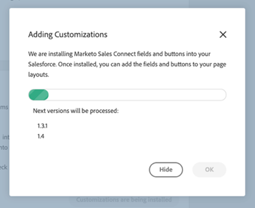

# CRM용 Sales Connect 사용자 지정 {#sales-connect-customizations-for-crm}

아래 필드와 단추는 Salesforce CRM의 메타데이터 API에 의해 만들어집니다. 필드가 만들어지면 관리자가 CRM에서 페이지 레이아웃을 구성하여 노출해야 합니다. 지침은 [여기](https://docs.marketo.com/display/docs/assets/marketo-sales-engage-for-salesforce-installation-and-success-guide.pdf).

>[!NOTE]
>
>이는 ToutApp 및 Sales Connect 고객에게 모두 영향을 줍니다.

## Salesforce에서 사용자 지정 설치 방법 {#how-to-install-customizations-in-salesforce}

1. Sales Connect에서 톱니바퀴 아이콘을 클릭하고 **설정**.

   

1. 관리자 설정에서 을 선택합니다. **Salesforce**.

   

1. 클릭 **Marketo Sales Connect 사용자 지정**.

   

1. 클릭 **Salesforce에 연결**.

   

1. Salesforce에 로그인.

   

## Salesforce 사용자 지정 업데이트 {#update-salesforce-customization}

Salesforce 사용자 지정 패키지 업데이트에는 개선 사항 및 버그 수정이 포함됩니다. 업데이트를 사용할 수 있는지 또는 업데이트를 수행할 수 있는지 확인하려면 아래 단계를 따르십시오.

>[!NOTE]
>
>**관리자 권한이 필요합니다.**

1. 에서 [웹 애플리케이션](https://www.toutapp.com), 톱니바퀴 아이콘을 클릭하고 을 선택합니다. **설정**.

   

1. 관리자 설정에서 을 클릭합니다. **Salesforce**.

   

1. Sales Connect Customization Card에서 업데이트를 사용할 수 있는지 여부를 표시합니다. 클릭 **사용자 지정 업데이트**.

   

1. 클릭 **업그레이드**.

   

1. 업데이트가 설치될 때까지 기다립니다. 필요한 버전 번호의 수에 따라 설치 시간이 달라집니다.

   

완료되면 카드에 &quot;Your Sales Connect Customizations are up to date(판매 연결 사용자 지정 항목이 최신 상태입니다.)&quot;가 표시됩니다.

## 사용자 지정 활동 필드 {#custom-activity-fields}

Marketo은 새 필드 만들기를 감지한 다음 일회성 데이터 채우기, 다시 매핑 및 지속적인 값 동기화를 수행합니다 **새** 필드만 사용됩니다. 이전 필드는 업데이트되지 않습니다.

| **필드 이름** | **설명** |
|---|---|
| MSE 호출 로컬 존재 ID | 사용자는 MSE Phone에서 전화를 걸 때 로컬 상태(Local Presence)를 옵션으로 선택할 수 있습니다. 수신 전화에는 수신자의 로컬 번호가 표시됩니다. |
| MSE 호출 기록 URL | 호출을 기록할 수 있고 녹음에 대한 링크가 여기에 기록됩니다. |
| MSE 캠페인 | Contact/Lead 가 Member인 MSE 캠페인의 로그 이름입니다. |
| MSE 캠페인 URL | MSE에서 생성된 캠페인에 URL을 기록합니다. 이를 클릭하면 MSE 웹 앱에서 캠페인이 열립니다. |
| MSE Campaign 현재 단계 | 연락처/리드가 캠페인의 일부인 경우 이 필드는 리드/연락처가 현재 있는 단계의 이름을 기록합니다. |
| MSE 전자 메일 첨부 파일 조회 | 첨부 파일과 함께 전자 메일이 전송되고 수신자가 첨부 파일을 볼 때 데이터를 기록합니다. |
| 클릭한 MSE 이메일 | 수신자가 이메일의 링크를 클릭할 때 확인 표시를 기록합니다. |
| MSE e-메일 응답 | 수신자가 전자 메일에 회신할 때 확인 표시를 기록합니다. |
| MSE 이메일 상태 | 이메일 전송/진행 중/바운스되는지 표시합니다(바운스된 이메일 추적은 사용된 게재 채널에 따라 다름). |
| MSE 이메일 템플릿 | 리드/연락처로 보낸 이메일에 사용된 MSE 템플릿의 로그 이름입니다. |
| MSE 이메일 템플릿 URL | MSE에서 만든 템플릿에 대한 URL을 기록합니다. 이 아이콘을 클릭하면 MSE 웹 앱에서 템플릿이 열립니다. |
| MSE 이메일 URL | 이 URL을 클릭하면 MSE의 Command Center가 열리고 보낸 전자 메일을 볼 수 있는 People Detail View History 탭이 열립니다. |
| MSE 이메일 확인함 | 수신자가 이메일을 볼 때 확인 표시를 기록합니다. |

## 롤업 로깅 필드 {#roll-up-logging-fields}

<table> 
 <colgroup> 
  <col> 
  <col> 
 </colgroup> 
 <tbody> 
  <tr> 
   <td><strong>필드 이름</strong></td> 
   <td><strong>설명</strong></td> 
  </tr> 
  <tr> 
   <td>MSE - 마지막 마케팅 참여</td> 
   <td>마케팅에서 마지막으로 들어오는 참여 </td> 
  </tr> 
  <tr> 
   <td>MSE - 마지막 마케팅 참여 날짜</td> 
   <td>마케팅의 참여 타임스탬프.</td> 
  </tr> 
  <tr> 
   <td>MSE - 마지막 마케팅 참여 설명</td> 
   <td>참여 설명.</td> 
  </tr> 
  <tr> 
   <td>MSE - 마지막 마케팅 참여 소스</td> 
   <td>마케팅 유도 소스.</td> 
  </tr> 
  <tr> 
   <td colspan="1">MSE - 마지막 마케팅 참여 유형</td> 
   <td colspan="1">참여 유형입니다.</td> 
  </tr> 
  <tr> 
   <td colspan="1">MSE - 판매별 마지막 활동 </td> 
   <td colspan="1">영업 팀에서 수행한 마지막 발신 활동.</td> 
  </tr> 
  <tr> 
   <td colspan="1">MSE - 마지막 응답</td> 
   <td colspan="1">Sales Email에 대한 마지막 이메일 회신</td> 
  </tr> 
  <tr> 
   <td colspan="1">MSE - 현재 영업 캠페인</td> 
   <td colspan="1">리드/연락처가 멤버인 MSE 캠페인의 로그 이름입니다.</td> 
  </tr> 
  <tr> 
   <td colspan="1">MSE - 마지막 판매 계약</td> 
   <td colspan="1">판매에서 들어오는 마지막 계약입니다. </td> 
  </tr> 
  <tr> 
   <td colspan="1">MSE - 옵트아웃</td> 
   <td colspan="1">옵트아웃 필드입니다.</td> 
  </tr> 
 </tbody> 
</table>

## 단추 {#buttons}

| **단추 이름** | **설명** |
|---|---|
| MSE 이메일 보내기 | Salesforce에서 판매 이메일을 보냅니다. |
| MSE Campaign에 추가 | Salesforce에서 MSE 캠페인에 를 추가합니다. |
| MSE로 푸시 | Salesforce에서 MSE로 연락처를 푸시합니다. |
| MSE를 사용하여 호출 | Salesforce에서 판매 호출을 실행합니다. |

## 벌크 작업 단추 {#bulk-action-buttons}

| **단추 이름** | **설명** |
|---|---|
| MSE Campaign에 추가 | Salesforce에서 MSE 캠페인에 를 추가합니다. |
| MSE로 푸시 | Salesforce에서 MSE로 연락처를 푸시합니다. |

## 사용 안내서 {#user-guides}

[Salesforce의 MSE 사용자 지정 보고서](https://docs.marketo.com/display/docs/assets/mse-custom-reports-in-sf.docx)

[Salesforce용 MSE](https://docs.marketo.com/display/docs/assets/mse-for-sf-classic.pdf)

[Salesforce Lightning용 MSE](https://s3.amazonaws.com/tout-user-store/salesforce/assets/SF+Guide+for+Lightning.pdf)
