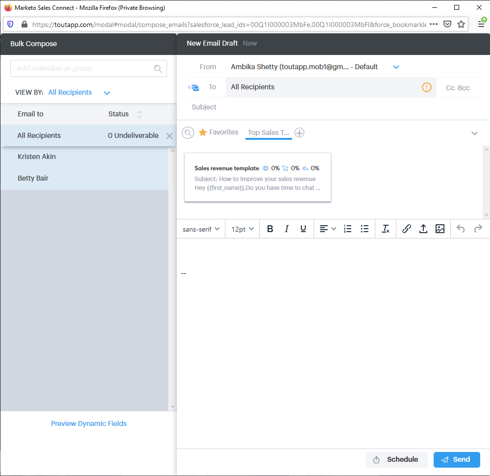

# Salesforce Classic에서 일괄 작업 사용 {#using-bulk-actions-in-salesforce-classic}

캠페인에 리드 추가, 대량 이메일 전송, Salesforce에서 Sales Connect로 리드 전달 등 일괄 작업을 수행하는 방법을 알아봅니다.

>[!PREREQUISITES]
>
>최신 버전의 Sales Connect 패키지로 업데이트하고 리드/연락처 보기에 벌크 작업 단추를 설치합니다. [지침을 보려면 여기를 클릭하십시오](http://s3.amazonaws.com/tout-user-store/salesforce/assets/Marketo+Sales+Engage+For+Salesforce_+Installation+and+Success+Guide.pdf).

>[!NOTE]
>
>아래에 설명된 단계를 수행하기 전에 Marketing To Sales Connect 계정에 로그인되어 있는지 확인합니다.

## 일괄 이메일 {#bulk-email}

1. Salesforce에서 **리드** 탭을 클릭한 다음 **이동** 단추를클릭합니다.

   

1. 원하는 리드를 선택하고 MSC가 **있는 이메일(클래식)** 단추를 클릭합니다.

   

1. MSC 이메일이 나타납니다. 여기에는 다음 기능이 포함됩니다.

   a.&quot;받는 사람&quot; 필드에 &quot;모든 영수증&quot;이 표시됩니다. 이 필드는 리드 목록 보기에서 선택한 리드 목록에 해당합니다\
   b.이 목록은 &quot;일괄 작성&quot;이라는 왼쪽 패널에서 볼 수 있습니다. 여기에서 수신자를 추가/제거할 수 있습니다\
   c. 템플릿을 선택하거나 직접 이메일을 만들 수 있습니다.\
   d.이메일에 채울 동적 필드를 미리 볼 수 있습니다\
   e.이메일을 즉시 보내거나 나중에 보내도록 예약할 수 있습니다

   

## 캠페인에 추가 {#add-to-campaign}

1. Salesforce에서 **리드** 탭을 클릭한 다음 **이동** 단추를클릭합니다.

   

1. 원하는 리드를 선택하고 MSC 캠페인에 **추가(클래식)** 단추를 클릭합니다.

   

1. &quot;캠페인에 사람 추가&quot; 팝업이 표시됩니다. [ **다음** ]을 클릭하고 일반적인 캠페인 흐름을 따라 MSC 캠페인을 트리거합니다.

   

## Marketing To Sales Connect로 푸시 {#push-to-marketo-sales-connect}

1. Salesforce에서 **리드** 탭을 클릭한 다음 **이동** 단추를클릭합니다.

   

1. 원하는 리드를 선택하고 MSC로 **푸시(클래식) 단추를** 클릭합니다.

   

1. &quot;Salesforce Bridge&quot;라는 새로운 탭이 열립니다. [그룹으로 **이동] 단추를** 클릭합니다.

   

1. MSC 계정으로 전송되어 날짜/시간 스탬프로 만든 그룹이 표시됩니다. 동기화가 완료되고 그룹에 Salesforce에서 동기화된 리드가 포함되면 알림이 수신됩니다.

   

>[!NOTE]
>
>연락처 목록 보기에서도 동일한 단계에 따라 일괄 작업을 사용할 수 있습니다.

>[!NOTE]
>
>**관련 문서**
>
>* [그룹 이메일을 통해 이메일 보내기](http://docs.marketo.com/x/KAQ6Ag)
>* [선택 및 전송을 사용하여 일괄 이메일 구성](http://docs.marketo.com/display/public/DOCS/Composing+Bulk+Emails+with+Select+and+Send#ComposingBulkEmailswithSelectandSend-SendingEmails)

>

