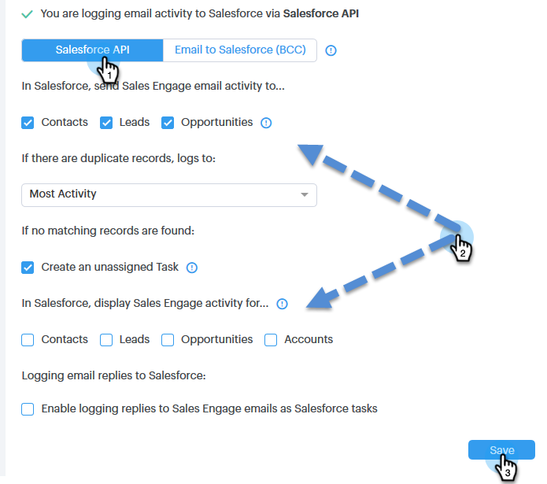

# Salesforce 동기화 설정 {#salesforce-sync-settings}

## API를 통해 Salesforce에 이메일 활동 기록 {#logging-email-activity-to-salesforce-via-api}

Web Services API를 통해 통합을 구입한 경우 이 기능을 사용하려면 Enterprise/Unlimited edition of Salesforce 또는 Professional 에디션에 있어야 합니다.

>[!PREREQUISITES]
>
>Salesforce 및 Sales Engage는 연결되어 있어야 합니다.

1. Sales Engage에서 오른쪽 상단의 톱니바퀴 아이콘을 클릭하고 **설정을 선택합니다**.

   

1. 내 계정(관리자의 경우 관리 설정)에서 **Salesforce를 클릭합니다**.

   

1. 설정 **동기화** 탭을 클릭합니다.

   

1. Salesforce에 이메일 활동 로그 옆의 화살표를 클릭합니다.

   

1. Salesforce **API** 탭을 클릭합니다. 이 카드에서 Salesforce에 정보 로깅에 대한 기본 설정을 설정할 수 있습니다. 완료되면 **저장을** 클릭합니다.

   

## Salesforce에 이메일을 통해 Salesforce에 이메일 활동 기록(BCC) {#logging-email-activity-to-salesforce-via-email-to-salesforce-bcc}

&quot;Salesforce에 이메일(BCC)&quot;을 활성화하면 판매 이메일의 숨은 참조 정보가 수신되고 이메일 정보가 기회, 리드 및 연락처에 대한 활동으로 기록됩니다.

>[!PREREQUISITES]
>
>Salesforce 및 Sales Engage는 연결되어 있어야 합니다.

**이메일(BCC)을 통해 Salesforce에 이메일을 기록하려면**

1. Sales Engage에서 오른쪽 상단의 톱니바퀴 아이콘을 클릭하고 **설정을 선택합니다**.

   

1. 내 계정(관리자의 경우 관리 설정)에서 **Salesforce를 클릭합니다**.

   

1. 설정 **동기화** 탭을 클릭합니다.

   

1. Salesforce에 **이메일(BCC)** 탭을 클릭하고 **활성화를 클릭합니다**.

   

어떤 이유로 Salesforce로 보낸 이메일 주소가 수신되지 않는 경우 다음 단계에 따라 Salesforce 계정에서 BCC 기능을 활성화합니다.

1. Salesforce 인스턴스에 로그인합니다.
1. 오른쪽 상단 모서리에서 사용자 이름을 찾아 드롭다운 막대를 선택합니다.
1. [ **내 설정]을 선택합니다**.
1. 이메일을 **선택합니다**.
1. Salesforce **에 내 이메일을 선택합니다**.
1. 이 페이지에는 &quot;Salesforce 주소로 이메일&quot; 레이블이 지정된 필드가 표시됩니다. 옆에 채워지지 않은 경우 &quot;내 허용 가능한 이메일 주소&quot;로 스크롤 다운합니다.
1. 숨은 참조 이메일 주소를 입력합니다.
1. 변경 내용 **저장을 클릭합니다**.

**내 설정에서 Salesforce로 보낸 이메일을 찾을 수 없음**

귀하의 설정 아래에 Salesforce에 내 이메일이 표시되지 않는 경우 관리자가 이를 활성화하지 않았을 수 있습니다. 팀이 Salesforce를 처음 사용하는 경우 또는 팀에서 Salesforce가 제공하는 숨은 참조 주소를 사용하지 않은 경우 이러한 문제가 발생할 수 있습니다.

>[!NOTE]
>
>이 설정을 하려면 관리자 권한이 필요합니다.

1. 설정을 **클릭합니다&#x200B;*.* **
1. [ **이메일 관리]를 클릭합니다&#x200B;*.* **
1. Salesforce **에 이메일을 클릭합니다&#x200B;*.* **
1. 편집을 **클릭합니다**.
1. &quot;활성*&quot; 옆의 상자를 선택합니다.*
1. 저장을 **클릭합니다&#x200B;*.* **

## 세일즈 참여 작업/미리 알림을 Salesforce 작업에 동기화 {#sync-sales-engage-tasks-reminders-to-salesforce-tasks}

1. 오른쪽 상단에 있는 톱니바퀴 아이콘을 클릭하고 **설정을 선택합니다**.

   

1. 내 계정(관리자의 경우 관리 설정)에서 **Salesforce를 클릭합니다**.

   

1. 설정 **동기화** 탭을 클릭합니다.

   

1. Salesforce 작업에 대한 영업 참여 작업/미리 알림 동기화 옆에 있는 화살표를 클릭합니다.

   

1. 원하는 옵션(&quot;Salesforce 작업에 동기화 안 함&quot;이 기본적으로 선택되어 있음)을 선택합니다.

   

