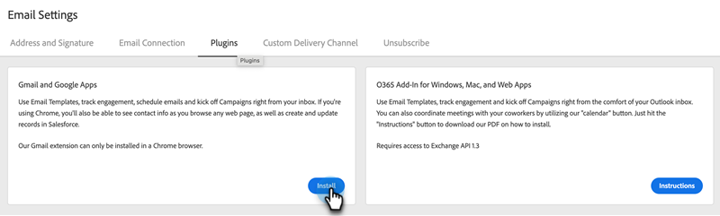

# Gmail용 Sales Connect 이메일 플러그인 설치 {#install-the-sales-connect-email-plugin-for-gmail}

Gmail 플러그인을 설치하는 방법을 알아봅니다.

>[!IMPORTANT]
>
>Gmail 및 Outlook용 이메일 플러그인은 Marketo Sales Connect 사용자에게만 지원됩니다. 영업 Insight 작업 사용자에 대해 지원되지 않는 **은(는)**&#x200B;입니다.

1. [웹 응용 프로그램](https://toutapp.com/next#settings)에서 톱니바퀴 아이콘을 클릭하고 **[!UICONTROL Settings]**&#x200B;을(를) 클릭합니다.

   

1. 내 계정에서 **[!UICONTROL Email Settings]**&#x200B;을(를) 클릭합니다.

   

1. **[!UICONTROL Plugins]** 탭을 클릭합니다.

   

1. Gmail 및 Google 앱에서 **[!UICONTROL Install]**&#x200B;을(를) 클릭합니다.

   
