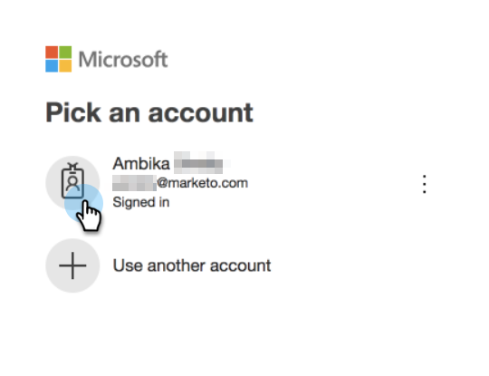

# Outlook 사용자를 위한 전자 메일 연결 {#email-connection-for-outlook-users}

Sales Connect 계정을 Outlook과 연결하는 방법을 알아봅니다.

>[!NOTE]
>
>각 사용자는 Sales Connect 계정에서 Outlook에 연결해야 합니다.

## Outlook Online {#connecting-to-outlook-online}에 연결

Outlook에 연결하면 회신 추적, Outlook 배달 채널에 액세스, Outlook에서 이메일을 예약하고 규정 준수를 보낼 수 있습니다.

1. Sales Connect에서 톱니바퀴 아이콘을 클릭하고 **설정**&#x200B;을 선택합니다.

   

1. 내 계정에서 **이메일 설정**&#x200B;을 선택합니다.

   

1. **이메일 연결** 탭을 클릭합니다.

   

1. **시작하기**&#x200B;를 클릭합니다.

   

1. **I use Outlook을 사용하여 이메일**&#x200B;을 선택하고 **다음**&#x200B;을 클릭합니다.

   

1. 사용 중인 Outlook 버전을 선택하고 **다음**&#x200B;을 클릭합니다. 이 예에서는 Outlook Online을 선택합니다.

   

   <table> 
    <tbody>
     <tr>
      <td><strong>Outlook Online</strong></td> 
      <td>Exchange Online이라고도 함</td> 
     </tr>
     <tr>
      <td><strong>사내 교환</strong></td> 
      <td>Exchange 2013 및 2016 포함</td> 
     </tr>
    </tbody>
   </table>

   >[!NOTE]
   >
   >현재 Exchange 하이브리드 계정을 지원하지 않습니다.

1. **확인**&#x200B;을 클릭합니다.

   

1. Outlook에 로그인하지 않은 경우 로그인 정보를 입력하고 **다음**&#x200B;을 클릭합니다. 원하는 경우 연결할 계정을 선택하고 **다음**&#x200B;을 클릭합니다. 이 예에서는 이미 로그인되어 있습니다.

   

1. **수락**&#x200B;을 클릭합니다.

   

   이 연결을 사용하여 이메일을 추적하고 배달 채널로도 사용할 수 있습니다.

   >[!NOTE]
   >
   >Outlook Online(Office365)에서는 자체 전송 제한을 적용합니다. [자세한 내용을 살펴보십시오](/help/marketo/product-docs/marketo-sales-connect/email/email-delivery/email-connection-throttling.md#email-provider-limits).

## Exchange 온-프레미스 {#connecting-to-exchange-on-premise}에 연결

Exchange 온-프레미스에 연결하면 회신 추적, Outlook 배달 채널에 액세스, Outlook에서 이메일을 예약하고 규정 준수를 보낼 수 있습니다.

1. Sales Connect에서 톱니바퀴 아이콘을 클릭하고 **설정**&#x200B;을 선택합니다.

   

1. 내 계정에서 **이메일 설정**&#x200B;을 선택합니다.

   

1. **이메일 연결** 탭을 클릭합니다.

   

1. **시작하기**&#x200B;를 클릭합니다.

   

1. **I use Outlook을 사용하여 이메일**&#x200B;을 선택하고 **다음**&#x200B;을 클릭합니다.

   

1. 사용 중인 Outlook 버전을 선택하고 **다음**&#x200B;을 클릭합니다. 이 예에서는 Exchange 온-프레미스를 선택합니다.

   

   <table> 
    <tbody>
     <tr>
      <td><strong>Outlook Online</strong></td> 
      <td>Exchange Online이라고도 함</td> 
     </tr>
     <tr>
      <td><strong>사내 교환</strong></td> 
      <td>Exchange 2013 및 2016 포함</td> 
     </tr>
    </tbody>
   </table>

1. 자격 증명을 입력하고 **Connect**&#x200B;를 클릭합니다.

   

   >[!NOTE]
   >
   >Exchange 버전 드롭다운에서 자동 검색을 해제하면 IT 부서에 Exchange URL을 요청해야 합니다.

   이 연결을 사용하여 이메일을 추적하고 배달 채널로도 사용할 수 있습니다.

   >[!NOTE]
   >
   >Exchange On-Prem을 사용하는 경우 IT 팀에서 이메일 전송 한도를 설정합니다.
