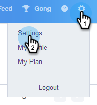

# Outlook 사용자를 위한 이메일 연결 탭 {#email-connection-tab-for-outlook-users}

Sales Connect 계정을 Outlook과 연결하는 방법을 알아봅니다.

>[!NOTE]
>
>각 사용자는 Sales Connect 계정에서 Outlook에 연결해야 합니다.

## Outlook Online에 연결 {#connecting-to-outlook-online}

Outlook에 연결하면 회신 추적, Outlook 배달 채널 액세스, Outlook에서 이메일 예약, 규정 준수 전송 등의 작업을 받게 됩니다.

1. Sales Connect에서 톱니바퀴 아이콘을 클릭하고 **설정을 선택합니다**.

   

1. 내 계정에서 이메일 **설정을 선택합니다**.

   

1. 이메일 연결 **탭을** 클릭합니다.

   

1. 시작 **을 클릭합니다**.

   

1. [ **Outlook을 사용하여 이메일** 보내기]를 선택하고 [다음]을 **클릭합니다**.

   

1. 사용 중인 Outlook 버전을 선택하고 [다음]을 **클릭합니다**. 이 예에서는 Outlook Online을 선택합니다.

   

   | **Outlook Online** | Office Online이라고도 함 |
   |---|---|
   | **사내 교환** | Exchange 2013 및 2016 포함 |

1. 확인을 **클릭합니다**.

   

1. Outlook에 로그인하지 않은 경우 로그인 정보를 입력하고 [다음]을 **클릭합니다**. 해당하는 경우 연결할 계정을 선택하고 [다음]을 **클릭합니다**. 이 예에서는 이미 로그인되어 있습니다.

   

1. [ **승인]을 클릭합니다**.

   

   이 연결을 사용하여 이메일을 추적하고 전달 채널 [으로 사용할 수 있습니다](http://docs.marketo.com/display/public/DOCS/Setting+up+Your+Delivery+Channel#SettingupYourDeliveryChannel-Gmail).

   >[!NOTE]
   >
   >Outlook을 배달 채널로 사용할 때는 한 번에 300개의 벌크 이메일을 보낼 수 없습니다.

## Exchange 온프레미스 연결 {#connecting-to-exchange-on-premise}

Exchange 온-프레미스에 연결하면 회신 추적, Outlook 배달 채널 액세스, Outlook에서 이메일 예약, 규정 준수 전송 기능을 받게 됩니다.

1. Sales Connect에서 톱니바퀴 아이콘을 클릭하고 **설정을 선택합니다**.

   

1. 내 계정에서 이메일 **설정을 선택합니다**.

   

1. 이메일 연결 **탭을** 클릭합니다.

   

1. 시작 **을 클릭합니다**.

   

1. [ **Outlook을 사용하여 이메일** 보내기]를 선택하고 [다음]을 **클릭합니다**.

   

1. 사용 중인 Outlook 버전을 선택하고 [다음]을 **클릭합니다**. 이 예에서는 Exchange 온-프레미스를 선택합니다.

   

   | **Outlook Online** | Office Online이라고도 함 |
   |---|---|
   | **사내 교환** | Exchange 2013 및 2016 포함 |

1. 자격 증명을 입력하고 **Connect를 클릭합니다**.

   

   >[!NOTE]
   >
   >Exchange 버전 드롭다운에서 자동 검색을 해제하면 IT 부서에 Exchange URL을 요청해야 합니다.

   [전달 채널로](http://docs.marketo.com/display/public/DOCS/Setting+up+Your+Delivery+Channel#SettingupYourDeliveryChannel-Gmail)

   >[!NOTE]
   >
   >Outlook을 배달 채널로 사용할 때는 한 번에 300개의 벌크 이메일을 보낼 수 없습니다.

이 연결을 사용하여 이메일 및 을 추적할 수 있습니다.