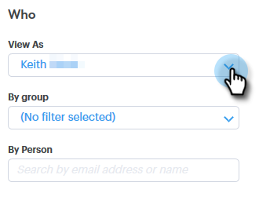
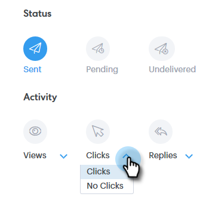

# 고급 검색 개요 {#advanced-search-overview}

고급 검색을 활용하여 이메일을 보거나 클릭했거나 회신한 잠재 고객을 타깃팅함으로써 가장 참여도가 높은 잠재 고객 목록을 만들 수 있습니다.

## 고급 검색에 액세스하는 방법 {#how-to-access-advanced-search}

1. 명령 **센터를 클릭합니다**.

   

1. 이메일을 **클릭합니다**.

   

1. 해당 탭을 선택합니다.

   

1. 고급 **검색을 클릭합니다**.

   

## 필터 {#filters}

**날짜**

검색에 사용할 날짜 범위를 선택합니다. 사전 설정 날짜는 선택한 이메일 상태(전송, 배달 안 됨, 보류 중)에 따라 업데이트됩니다.

**Who**

보낸 사람 섹션에서 이메일 수신자/보낸 사람별로 필터링합니다.

| **다른 이름으로 보기** | Sales Connect 인스턴스의 특정 보낸 사람별로 필터링합니다(이 옵션은 관리자만 사용할 수 있음). |
|---|---|
| **그룹별** | 특정 수신자 그룹별로 이메일을 필터링합니다. |
| **개인별** | 특정 수신자별로 필터링합니다. |

**언제**

생성된 일자, 배달된 날짜, 실패한 날짜 또는 예약된 날짜별로 선택합니다. 사용 가능한 옵션은 선택한 이메일 상태(전송, 배달되지 않음, 보류 중)에 따라 달라집니다.

**캠페인**

캠페인 기여도별로 이메일을 필터링합니다.

**상태**

선택할 이메일 상태는 세 가지입니다. 유형/활동 옵션은 선택한 상태에 따라 달라집니다.

***상태:전송***

보낸 이메일 활동별로 필터링합니다. 보기/보기 안 함, 클릭/클릭 안 함, 회신/답글 없음을 선택할 수 있습니다.

***상태:보류 중***

보류 중인 모든 이메일별로 필터링합니다.

| **예약됨** | 작성 창(Salesforce 또는 웹 앱), 이메일 플러그인 또는 캠페인에서 예약된 이메일 |
|---|---|
| **초안** | 현재 초안 상태인 이메일. 초안으로 저장하려면 제목 줄과 수신자가 있어야 합니다. |
| **진행 중** | 전송 중인 이메일 이메일은 몇 초 이상 이 상태로 유지되어서는 안 됩니다. |

***상태:천지***

배달되지 않은 이메일별 필터

| **실패** | Sales Connect에서 이메일을 보내지 못하는 경우(일반적인 이유는 다음과 같습니다.구독이 취소되거나 차단된 연락처에 전송되는 이메일 또는 동적 필드를 채우는 데 문제가 있는 경우) |
|---|---|
| **바운스됨** | 받는 사람의 서버에서 이메일을 거부하면 바운스된 것으로 표시됩니다. Sales Connect 서버를 통해 전송된 이메일만 여기에 표시됩니다. |
| **스팸** | 이메일이 받는 사람이 스팸으로 표시한 경우(요청되지 않은 이메일의 일반 용어) Sales Connect 서버를 통해 전송된 이메일만 여기에 표시됩니다. |

## 저장된 검색 {#saved-searches}

저장된 검색을 만드는 방법을 설명합니다.

1. 모든 필터가 적용된 후 [다른 이름으로 필터 **저장]을 클릭합니다**.

   

1. 검색 이름을 지정하고 저장을 **클릭합니다**.

   

   저장된 검색은 왼쪽의 세로 막대에 있습니다.

   

