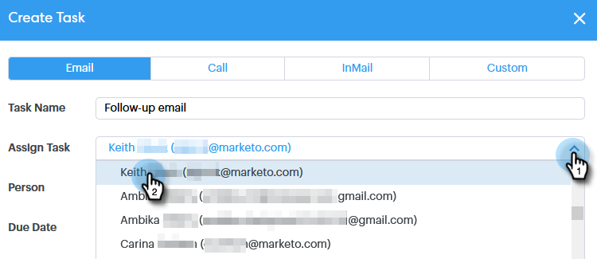

# 팀 구성원에게 작업 할당 {#assigning-tasks-to-team-members}

다른 팀 구성원과 공동 작업을 수행하려는 경우 작업을 할당하면 전망 작업을 조정할 수 있습니다.

>[!NOTE]
>
>공유 연락처에 대한 작업만 할당할 수 있습니다.

1. **명령 센터**&#x200B;를 클릭합니다.

   

1. **작업 추가**&#x200B;를 클릭합니다.

   

1. 작업 유형을 선택합니다.

   

1. 작업에 이름을 지정합니다.

   

1. 작업 지정 필드에서 작업을 지정할 팀의 사람을 선택합니다.

   

1. 사람 필드에 연락할 사람을 추가합니다.

   

1. 만기 일자를 선택합니다.

   

1. 우선 순위를 설정합니다.

   

1. 동료를 위한 중요한 세부 정보(선택 사항)를 추가하고 **만들기**&#x200B;를 클릭합니다.

   
