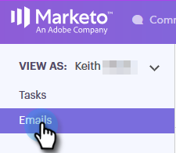

# 이메일 열 및 이메일 페이지 레이아웃 {#email-columns-and-email-page-layout}

사용 가능한 열을 명령 센터의 이메일 섹션에 표시하도록 구성할 수 있습니다. 구성 설정은 각 이메일 하위 폴더(예: 배달, 실패, 예약됨 등)에 대해 저장됩니다.

## 이메일 열 {#email-columns}

<table> 
 <colgroup> 
  <col> 
  <col> 
 </colgroup> 
 <tbody> 
  <tr> 
   <th>
열
</th> 
   <th>설명</th> 
  </tr> 
  <tr> 
   <td>Person</td> 
   <td>Sales Connect의 사람 이름 및 이메일. 이 필드를 클릭하면 개인 세부 사항 보기에 정보 탭이 열립니다.</td> 
  </tr> 
  <tr> 
   <td>이름</td> 
   <td>Sales Connect에 있는 사람의 이름입니다.</td> 
  </tr> 
  <tr> 
   <td>주소</td> 
   <td>Sales Connect에 있는 사람의 기본 이메일 주소입니다.</td> 
  </tr> 
  <tr> 
   <td>캠페인</td> 
   <td>캠페인의 일부로 이메일을 보낸 경우 캠페인 이름이 표시됩니다. 이 필드를 클릭하면 해당 캠페인의 설정 페이지로 이동합니다.</td> 
  </tr> 
  <tr> 
   <td>템플릿</td> 
   <td>템플릿 이름을 표시합니다(전자 메일이 하나로 전송된 경우).</td> 
  </tr> 
  <tr> 
   <td colspan="1">제목</td> 
   <td colspan="1">이메일의 제목 줄.</td> 
  </tr> 
  <tr> 
   <td colspan="1">그룹</td> 
   <td colspan="1">이메일 수신자가 속한 그룹을 표시합니다.</td> 
  </tr> 
  <tr> 
   <td>직함</td> 
   <td>전자 메일 받는 사람의 제목입니다.</td> 
  </tr> 
  <tr> 
   <td>회사</td> 
   <td>전자 메일 받는 사람의 회사.</td> 
  </tr> 
  <tr> 
   <td>이메일 상태</td> 
   <td>이메일이 있는 상태입니다. 상태는 다음과 같습니다.초안, 예약됨, 진행 중, 스팸, 반송됨, 실패함, 전송됨. 보낸 이메일에는 해당 이메일에서 발생한 보기, 클릭 및 답글의 수를 보여주는 활동 스트림이 표시됩니다.</td> 
  </tr> 
  <tr> 
   <td>만든 날짜</td> 
   <td>이메일을 만든 날짜입니다.</td> 
  </tr> 
  <tr> 
   <td>마지막 업데이트</td> 
   <td>이메일이 마지막으로 업데이트된 날짜입니다.</td> 
  </tr> 
  <tr> 
   <td>배달 채널</td> 
   <td>이메일을 전송하는 데 사용된 배달 채널의 이름입니다.</td> 
  </tr> 
  <tr> 
   <td>최신 활동</td> 
   <td>이메일 수신자의 마지막 참여(예: 보기, 클릭 또는 응답).</td> 
  </tr> 
  <tr> 
   <td>보낸 날짜</td> 
   <td>이메일을 보낸 날짜입니다.</td> 
  </tr> 
  <tr> 
   <td>추가 작업</td> 
   <td>이메일, 전화, inMail 또는 작업을 통해 후속 작업에 사용할 수 있는 빠른 작업 단추입니다.</td> 
  </tr> 
  <tr> 
   <td>그룹 이메일</td> 
   <td>그룹 이메일의 일부로 이메일을 보낸 경우 확인 표시를 표시합니다.</td> 
  </tr> 
  <tr> 
   <td>작업 기한</td> 
   <td>이메일과 관련된 작업의 기한을 표시합니다. 작업은 이메일 목록의 빠른 작업 단추를 사용하여 이메일과 관련되어 있을 수 있습니다.</td> 
  </tr> 
  <tr> 
   <td>이메일 작업</td> 
   <td>이메일에서 작업을 수행하는 데 사용할 수 있는 빠른 작업 단추입니다. 이메일 상태에 따라 다음 작업을 사용할 수 있습니다.보관, 성공, 삭제, 전송 다시 시도, 보관 취소.</td> 
  </tr> 
  <tr> 
   <td>작업 유형</td> 
   <td>이메일과 관련된 작업의 작업 유형을 표시합니다. 작업은 이메일 목록의 빠른 작업 단추를 사용하여 이메일과 관련되어 있을 수 있습니다.</td> 
  </tr> 
  <tr> 
   <td>실패 날짜</td> 
   <td>이메일이 배달되지 않은 경우 이메일이 배달되지 못한 날짜를 표시합니다.</td> 
  </tr> 
 </tbody> 
</table>

## 이메일 페이지 레이아웃 설정 {#email-page-layout-settings}

다음 단계에 따라 레이아웃을 구성할 수 있습니다.

1. 명령 센터로 이동합니다.

   

1. **이메일** 섹션을 선택합니다.

   

1. 구성 단추를 클릭합니다. 옵션은 다음과 같습니다.원하는 행 수 선택, 표시할 필드 선택 및 그룹 이메일을 격자의 단일 항목으로 롤업할지 선택(또는 이메일 격자에 포함된 모든 이메일을 단일 항목으로 표시하려면 선택).

   

1. 완료되면 구성 외부를 클릭하면 됩니다.

